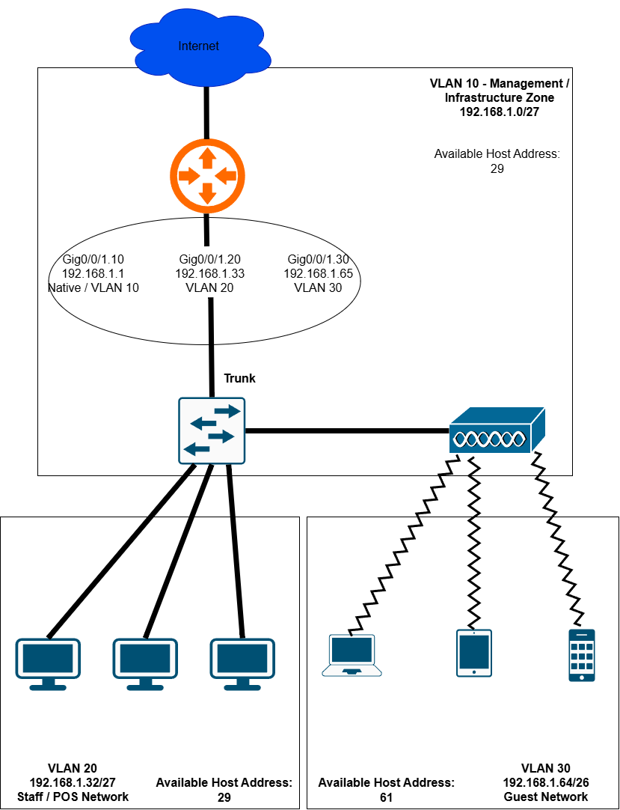

# Secure SOHO Branch Network Architecture & Segmentation

## Executive Summary & Business Rationale
This project demonstrates the design and implementation of a segmented SOHO (Small Office/Home Office) branch network for a retail coffee shop environment. 

The primary business objective is to balance open customer connectivity with strict operational security. Using vendor-neutral network engineering principles, the architecture isolates Point-of-Sale (POS) payment processing and local network management from public guest Wi-Fi, satisfying security baseline requirements (such as PCI-DSS data isolation principles).

---

## Network+ Technical Domain Mapping

| Network+ Domain | Applied Project Implementation |
| :--- | :--- |
| **1.0 Networking Concepts** | VLSM Subnetting, IPv4 addressing, 802.1Q VLAN Tagging, CIDR calculation |
| **2.0 Network Implementation** | Router-on-a-Stick inter-VLAN routing, dynamic IP allocation (DHCP Server), Access/Trunk port roles |
| **3.0 Network Operations** | Infrastructure IP management, interface status verification, centralized network topology documentation |
| **4.0 Network Security** | Traffic separation, Layer 3/4 Access Control Lists (ACLs), Wireless WPA2-PSK encryption, Guest Network isolation |
| **5.0 Network Troubleshooting** | Systematic OSI-model diagnostic methodology (Link layer checks up to Layer 3 ICMP verification) |

---

## Subnetting & VLSM Architecture Plan

To minimize IP address waste while allowing room for growth, a single **`192.168.1.0/24`** address block was variable-length subnetted into three functional security zones:

| Functional Zone | Segment / Purpose | Subnet & CIDR | Subnet Mask | Usable Host Range | Default Gateway |
| :--- | :--- | :--- | :--- | :--- | :--- |
| **Management Zone** | Infrastructure Management (Switch SVI, AP) | `192.168.1.0/27` | `255.255.255.224` | `192.168.1.2 - 192.168.1.30` | `192.168.1.1` |
| **Operational Zone** | POS Registers & Manager Workstations | `192.168.1.32/27` | `255.255.255.224` | `192.168.1.34 - 192.168.1.62` | `192.168.1.33` |
| **Public Zone** | Customer Wi-Fi Access | `192.168.1.64/26` | `255.255.255.192` | `192.168.1.66 - 192.168.1.126` | `192.168.1.65` |

### VLSM Design Rationale
* **Management & Staff (`/27`):** Allocated 30 usable host IPs each, providing sufficient capacity for local store hardware while enforcing tight boundaries.
* **Guest Network (`/26`):** Allocated 62 usable host IPs to accommodate higher concurrent client density (phones, laptops, tablets) during peak hours.

---

## Architectural Implementation Breakdown

### 1. Layer 2 Segmentation & Trunking Logic
* **VLAN 10 (Management):** Serves as the native VLAN for network equipment management interfaces.
* **VLAN 20 (Staff & POS):** Bound strictly to wired switch ports (`Fa0/1 - Fa0/3`) connecting local operational devices.
* **VLAN 30 (Guest Wi-Fi):** Mapped to the wireless access point interface (`Gi0/2`) to keep customer radio traffic logically separated from the rest of the switch.
* **802.1Q Trunk Link:** Configured on the uplink interface (`Gi0/1`) to pass tagged frames for VLANs 10, 20, and 30 across a single physical cable to the gateway router.

### 2. Layer 3 Routing & IP Allocation
* **Inter-VLAN Gateway:** Configured subinterfaces on the router to act as default gateways for each VLAN, providing routing between subnets where permitted.
* **Dynamic Addressing (DHCP):** Established address pools on the gateway to handle automatic IP assignment for staff and guest devices, excluding static management IPs.

### 3. Security Policy & Traffic Isolation Logic
A perimeter security policy was implemented at the default gateway using packet filtering rules:
* **Rule 1 (Deny):** Explicitly blocks all IP traffic from the Guest subnet (`192.168.1.64/26`) to the POS subnet (`192.168.1.32/27`).
* **Rule 2 (Deny):** Explicitly blocks Guest traffic from reaching infrastructure management interfaces (`192.168.1.0/27`).
* **Rule 3 (Permit):** Allows Guest traffic to reach any destination outside local internal subnets (e.g., WAN/Internet access).

---

## Verification & Troubleshooting Log

### Verification Scenario 1: Automated IP Configuration
* **Objective:** Ensure wireless guest clients receive correct dynamic addressing parameters.
* **Observation:** Wireless client connected to SSID `CoffeeShop_Guest` successfully leased IP `192.168.1.66` with subnet mask `255.255.255.192` and default gateway `192.168.1.65`.

### Verification Scenario 2: Security Policy Enforcement Test
* **Objective:** Confirm Guest Wi-Fi devices cannot communicate with operational POS terminals.
* **Action:** Issued `ping 192.168.1.34` (POS Terminal) from `192.168.1.66` (Guest Laptop).
* **Result:** **Traffic Blocked** (`Destination Host Unreachable`). Packet filter counters confirmed drops on inbound guest traffic.

### Troubleshooting Case: Physical Layer Link Negotiation
* **Issue:** Switch trunk link status remained inactive after applying VLAN parameters.
* **Root Cause:** Gateway router interface defaulted to an administratively shutdown state, preventing physical layer link negotiation.
* **Resolution:** Brought the physical router interface up (`no shutdown`), enabling the switch to establish the active 802.1Q trunk.

---

## Tools & Technologies Used
* **Network Simulator:** Cisco Packet Tracer (v8.x)
* **Protocols & Concepts:** Ethernet, 802.1Q Trunking, IEEE 802.11 Wireless, IPv4 VLSM Subnetting, DHCP, Layer 3/4 Packet Filtering (ACLs), ICMP Diagnostic Tools.