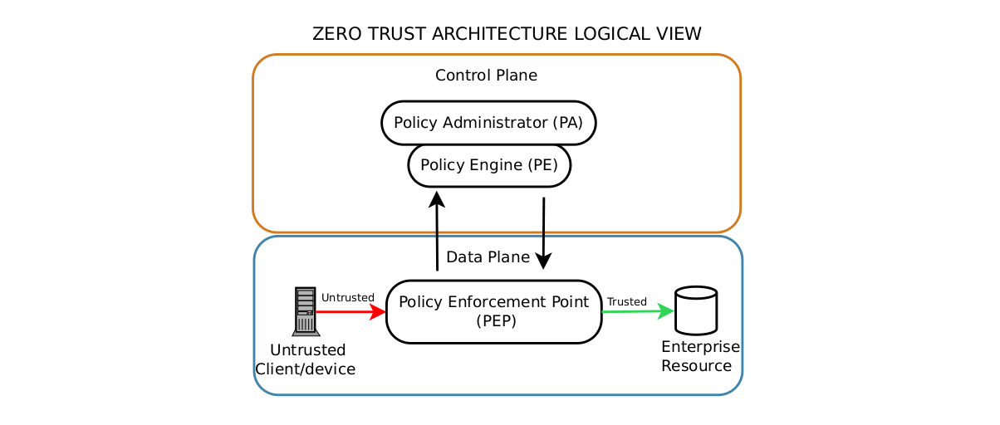
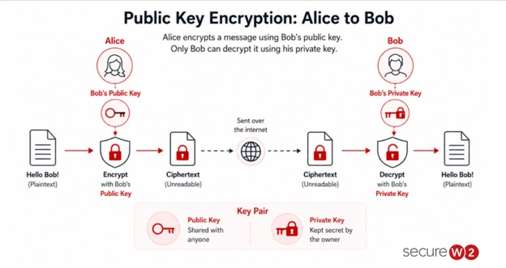
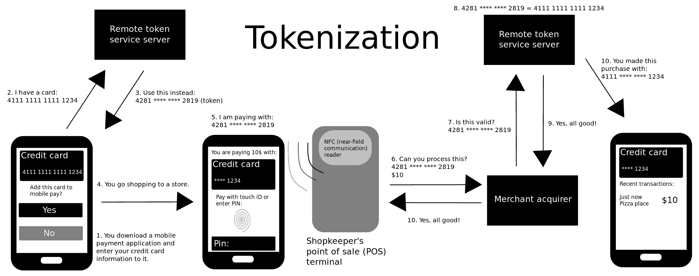

# Domain 1: **General Security Controls**

# Objective 1.1: `Security Controls`
Security controls are the safeguards and countermeasures implemented by an organization to preserve the **Confidentiality, Integrity, and Availability (CIA Triad)** of its assets, mitigate risk, and meet legal or regulatory compliance requirements.
<br>

There are 2 core areas:
1. Categories: *How* the control is implemented
2. Types: *What* the control achieves within the incident timeline.

## Control Categories
Control categories define the underlying nature of the safeguard - whether it is enforced by technical hardware/software, policy and governance, human activity, or physical barriers.

```
┌───────────────────┬────────────────────┬──────────────────┬──────────────────┐
│ Technical         │ Managerial         │ Operational      │ Physical         │
│ (Logical)         │ (Administrative)   │ (Procedural)     │ (Tangible)       │
├───────────────────┼────────────────────┼──────────────────┼──────────────────┤
│ System-enforced   │ Policy, governance │ Human-executed   │ Environment      │
│ software/hardware │ & risk oversight   │ operational tasks│ & infrastructure │
└───────────────────┴────────────────────┴──────────────────┴──────────────────┘
```
Use acronym **`TMOP`** as a memory aid

### Technical Controls
This is hardware, software, or firmware mechanisms implemented within computer systems, networks, and applications to enforce security rules automatically **without** human intervention.
<br>

How it works: 
- They `intercept data` at different layers of the OSI model, inspecting packet headers or payloads, evaluating system state, or enforcing cryptographic algorithms. 
- They act as automated enforcement gates directly within systems.
<br>

Examples:
- **Firewalls:** Inspect traffic flow against Access Control Lists (ACLs) or application-layer inspection algorithms to `permit or block packets` based on IP, port, protocol, or application signature.

- **Intrusion Prevention Systems (IPS):** Analyze network traffic using signature-based detection (comparing packet bytes to known attack vectors) or anomaly-based detection (flagging deviations from a baseline) to inline-drop malicious traffic.

- *Access Control Lists (ACLs):* Enforce identity-based or rules-based decisions directly on routers, switches, or cloud virtual networks (e.g., AWS Security Groups).

- **Endpoint Detection and Response (EDR) / Antivirus (AV):** Software agents executing at the kernel or user level that hook into system APIs to analyze process execution, memory space, and file signatures.

- **Encryption Protocols:** Implementation of algorithms (e.g., AES-256, TLS 1.3) to protect data at rest (Full Disk Encryption via BitLocker) or data in transit (HTTPS/IPsec).

### Managerial Controls
Managerial controls focus on administrative governance, risk evaluation, policy formulation, compliance oversight, and overall security strategy set by executive leadership and security managers.
<br>

How it works: 
- These controls provide the `legal, policy, and framework structure for the organization`. 
- They define what is acceptable, establish liability, allocate resources, and outline consequences for non-compliance.

Examples:
- **Security Policies:** Formal documentation defining organizational expectations (e.g., Acceptable Use Policy (AUP), Password Policy, Data Retention Policy).

- **Risk Assessments:** The process of identifying, analyzing, and evaluating risks (calculating Single Loss Expectancy (SLE), Annualized Rate of Occurrence (ARO), and Annualized Loss Expectancy (ALE)).

- **Vulnerability Management Policies:** Frameworks mandating scanning intervals, remediation SLAs, and risk acceptance protocols.

- **Third-Party Risk Management (TPRM):** Establishing vendor assessment frameworks, Service Level Agreements (SLAs), and Non-Disclosure Agreements (NDAs).

### Operational Controls
Operational controls are administrative and day-to-day security measures executed primarily by people rather than automated systems. They represent the practical, procedural implementation of managerial policies.
<br>

How it works: 
- Operational controls rely on `human execution, daily routines, tactical procedures, and awareness training` to keep security operations running consistently.

Examples:
- **Security Awareness Training:** Educating employees to recognize phishing attempts, social engineering tactics, and poor credential hygiene (e.g., phishing simulation exercises).

- **User Onboarding and Offboarding Procedures:** Manual human checklists followed by HR and IT admins to grant or revoke access privileges, recover company assets, and deactivate accounts.

- **Security Guard Patrols:** Human personnel physically walking the perimeter or monitoring facility access points.

- **Configuration & Patch Management:** The operational routine of testing, approving, and scheduling software patches and standard build deployments across infrastructure.

- **Incident Response Plan Execution:** Human incident responders conducting triage, containment, and root-cause analysis following an alert.

### Physical Controls
Physical controls are tangible, real-world measures designed to prevent physical access to facility grounds, buildings, equipment rooms, and physical assets, as well as protect against environmental hazards.
<br>

How it works: 
- They establish `physical barriers or environmental conditions` that prevent unauthorized physical entry, protect hardware from physical tampering/theft, or mitigate environmental disasters (fire, heat, power failure).

Examples:
- **Perimeter Fencing & Gates:** Structural barriers delaying or preventing unauthorized access to facility grounds.

- **Bollards:** Physical posts engineered to stop vehicle ramming attempts against buildings.

- **Locks and Smart Cards / Badges:** Electronic Access Control (EAC) systems using RFID badges, keycards, or mechanical deadbolts to restrict entry to server rooms.

- **Mantrap / Air Lock Systems:** Dual-door physical access control systems where the second door cannot open until the first door closes, preventing tailgating/piggybacking.

- **Environmental Controls:** HVAC systems maintaining server room temperature/humidity, fire suppression systems (e.g., FM-200 or dry-pipe sprinkler systems), and uninterrupted power supplies (UPS) / diesel backup generators.

## Control Types
Control types define when and why a control operates during an incident lifecycle - whether it prevents, deters, detects, corrects, compensates, or directs security posture.
```
+---------------------------------------------------------------------------------------+
|                                    CONTROL TYPES                                      |
+--------------+-------------+---------------+---------------+--------------+-----------+
| Preventive   | Deterrent   | Detective     | Corrective    | Compensating | Directive |
+--------------+-------------+---------------+---------------+--------------+-----------+
| Stops an     | Discourages | Identifies &  | Restores      | Alternative  | Mandates  |
| attack before| an attack   | logs active or| system back to| workaround   | required  |
| execution    | attempt     | past breaches | normal state  | safeguard    | behavior  |
+--------------+-------------+---------------+---------------+--------------+-----------+
```
Memory aid:  `Please Don't Delay, Correct Countermeasures Directly` === **PDDCCD**
- P - Preventive
- D - Deterrent
- D - Detective
- C - Corrective
- C - Compensating
- D - Directive

### Preventive Controls
Preventive controls act **proactively** to stop an unwanted or unauthorized activity from occurring in the first place.

Underlying Mechanics: They enforce strict access rules, drop unauthorized connection requests, or physically lock out attackers so that a breach attempt fails at the threshold.

Examples across Categories:
- **Technical:** 
    - Firewalls blocking incoming unauthorized ports.
    - IPS inline-dropping malicious payloads.
    - Least Privilege access policies enforced via Active Directory/IAM.
- **Managerial:** Onboarding security policy prohibiting account creation without multi-factor authorization approval.
- **Operational:** Separation of Duties (SoD) requiring two administrators to authorize a critical system change.
- **Physical:** Door locks, biometric scanners, and mantraps physically blocking access to a server closet.

### Deterrent Controls
Deterrent controls do not technically or physically stop an attack, but they are `designed to discourage a potential attacker from attempting` an exploit by increasing perceived cost, effort, or legal risk.

Underlying Mechanics: They leverage psychological disincentives, explicit warnings of legal liability, or visible security presences that alter an adversary's risk-versus-reward calculation.

Examples across Categories:
- **Technical:** Warning banners displayed on system login terminals (e.g., "Unauthorized access is prohibited and monitored under federal law").
- **Managerial:** Clear organizational policy stating that unauthorized data access results in immediate termination and legal prosecution.
- **Operational:** Uniformed security guards patrolling a facility perimeter; visible security personnel in reception.
- **Physical:** Highly visible warning signs ("Premises Under 24/7 Video Surveillance"), dummy security cameras, or high-intensity perimeter lighting.

### Detective Controls
Detective controls `operate during or after an attack` attempt to discover, identify, and log unauthorized activity or policy violations.

Underlying Mechanics: 
- They continuously monitor state changes, log output, traffic patterns, file integrity hashes, or physical movement, alerting administrators so action can be taken. 
- They **do not block the attack on their own**.

Examples across Categories:
- **Technical:** 
    - Intrusion Detection Systems (IDS) sniffing network traffic and alerting on signature matches.
    - Security Information and Event Management (SIEM) aggregating logs.
    - File Integrity Monitoring (FIM) calculating SHA-256 hashes of critical system files to detect modification.
- **Managerial:** Periodic audit reviews of user privileges and access log reports.
- **Operational:** 
    - Guard patrols conducting routine checks of lock integrity.
    - Threat hunting activities performed by SOC analysts.
- **Physical:** 
    - CCTV security cameras recording entryways.
    - Motion sensors in data centers.

### Corrective Controls
Corrective controls are `applied after a detective control` discovers an incident. Their objective is to reverse the damage, contain the impact, patch the underlying vulnerability, and return systems to a known-good operational state.

Underlying Mechanics: They alter system configuration, eliminate malicious artifacts, invoke failover procedures, or restore data from isolated backups.

Examples across Categories:
- **Technical:** 
    - Automatically restoring encrypted files from clean offline/cloud backups following a ransomware attack; running anti-malware quarantine/cleaning routines.
    - Applying vendor patch updates to fix exploited software bugs.
- **Managerial:** Incident Response Policy execution guidelines outlining escalation pathways and lessons-learned post-mortems.
- **Operational:** 
    - Calling emergency law enforcement after a break-in.
    - Isolating an infected endpoint from the VLAN via network access control (NAC).
- **Physical:** Fire extinguisher systems or dry-pipe fire suppression systems deployed to put out server room fires.

### Compensating Controls
Compensating controls are `alternative, backup countermeasures` implemented when a primary security control is impossible, too expensive, or technically unfeasible to deploy (e.g., legacy systems that cannot support modern encryption or authentication protocols).

Underlying Mechanics: They build a secondary protective boundary around a vulnerable asset to mitigate the specific risk that the absent primary control was meant to handle.

Examples across Categories:
- **Technical:** Placing a legacy, unpatchable industrial SCADA machine on an isolated virtual local area network (VLAN) with strict firewall microsegmentation because the vendor application cannot run on a modern, secure OS.
- **Managerial:** Requiring dual-signature sign-off for wire transfers exceeding $10,000 to compensate for the lack of automated transactional limits in an accounting system.
- **Operational:** Implementing temporary 24/7 security guard watch at a server room door while an electronic badge reader system is undergoing repair.
- **Physical:** Deploying portable emergency diesel generators to supply power during a total municipal utility failure.

### Directive Controls
Directive controls `mandate compliance` with explicit operational requirements, standards, or legal guidelines.

Underlying Mechanics: They set explicitly dictated terms for acceptable behavior through policies, organizational mandates, signs, or regulatory standard enforcement.

Examples across Categories:
- **Technical:** System storage policies directing employees to save sensitive files strictly within encrypted cloud directories rather than local drives.
- **Managerial:** Mandating compliance frameworks such as PCI-DSS or GDPR across the organization.
- **Operational:** Security awareness training sessions instructing employees on how to handle sensitive media (e.g., Clean Desk Policy).
- **Physical:** "Authorized Personnel Only" signs posted on doors leading to sensitive operational areas.

## Exam Tips:
Ask myself these questions in the exam or when unsure:
1. Identify the Core Mechanism First (`Category`):
    - Ask: Is this enforced by software/code/hardware? $\rightarrow$ **Technical**
    - Ask: Is this an executive policy, documentation, or risk assessment? $\rightarrow$ **Managerial**
    - Ask: Is a human physically executing a daily routine or training? $\rightarrow$ **Operational**
    - Ask: Can I physically touch it, or does it protect physical space? $\rightarrow$ **Physical**

2. Identify the Timing & Objective Second (`Type`):
    - Ask: Did it stop the attack before it happened? $\rightarrow$ **Preventive**
    - Ask: Did it try to discourage or scare the attacker away? $\rightarrow$ **Deterrent**
    - Ask: Did it log, alert, or record what happened without stopping it? $\rightarrow$ **Detective**
    - Ask: Did it fix, restore, or clean up after detection? $\rightarrow$ **Corrective**
    - Ask: Is it a workaround covering for a missing primary control? $\rightarrow$ **Compensating**
    - Ask: Is it a written or posted command mandating behavior? $\rightarrow$ **Directive**
<br>
---

# Objective 1.2: `Security Concepts`

## 1. CIA Triad (Confidentiality, Integrity, Availability)
The CIA triad is the foundational framework used to evaluate and implement information security controls.
```

                  [ Confidentiality ]
                     /           \
                    /   Security  \
                   /    Balance    \
                  /                 \
        [ Integrity ] ------------- [ Availability ]
```
### Confidentiality
Ensures that sensitive information is `accessible only to authorized subjects` (users, processes, or systems) and is protected against unauthorized disclosure or eavesdropping.

Underlying Mechanics:
- **Symmetric Encryption:** Uses a single shared key to encrypt bulk data at rest or in transit.
- **Asymmetric Encryption:** Uses key pairs (Public Key for encryption, Private Key for decryption) for secure key exchanges and token validation.
- **Access Control Lists (ACLs):** Enforces permissions at the filesystem or network level (firewall rule sets) using security identifiers (SIDs).
- **Obfuscation & Steganography:** Hides plain text within other data carriers or transforms code structure without changing execution logic to slow down reverse engineering.

### Integrity
Guarantees that `data remains accurate, complete, and untampered` with during storage, transit, or processing.

Underlying Mechanics:
- **Cryptographic Hashing:** 
    - One-way mathematical algorithms (e.g., SHA-256) generate a fixed-length digest from variable-length input. 
    - Any single-bit change in the source changes the resulting hash (aka avalanche effect).
- **Digital Signatures:** 
    - Combines a cryptographic hash of a payload with the sender’s private key. 
    - Recipients verify the origin and integrity using the sender's public key.
- **Message Authentication Codes (MAC / HMAC):** Combines a secret key with a cryptographic hash function to ensure both data integrity and data authenticity over network channels.

### Availability
Ensures systems, networks, applications, and data remain `accessible and fully operational` for authorized users when needed.

Underlying Mechanics:
- **Redundancy & Clustering:** High Availability (HA) pairs, active-active or active-passive server clusters running load balancers (e.g., round-robin or least-connections algorithms) to prevent Single Points of Failure (SPOFs).
- **RAID Storage Configurations:** Disk mirroring (RAID 1) or block-level striping with distributed parity (RAID 5/6) allowing continuous array operation during physical drive failures.
- **Site Fault Tolerance:** 
    - Hot sites (near-zero RTO with active replication).
    - Warm sites (pre-configured hardware requiring data restoration).
    - Cold sites (power/cooling available without operational hardware).
- **DDoS Mitigation:** Upstream traffic scrubbing centers, rate limiting, and Anycast network routing to absorb volumetrically saturated link attacks.

## 2. Non-Repudiation
Non-repudiation provides `indisputable proof of the origin, authenticity, and integrity of a transaction or message`, preventing an entity from denying their involvement in an action.

Underlying Technical Mechanics:
- **Digital Signatures:** When a user signs a transaction, their local system hashes the document digest and encrypts it using their private key. Because only the user possesses that private key, successful decryption via their public key proves they initiated the transaction.
- **Asymmetric Key Lifecycle:** Enforced through a Public Key Infrastructure (PKI) where a Certificate Authority (CA) binds a verified user identity to a public/private key pair via x.509 digital certificates.
- **Centralized Immutable Logging:** Audit logs shipped to Write-Once-Read-Many (WORM) storage or cryptographic log chains (append-only ledgers) tagged with NTP-synchronized timestamps prevent post-event log tampering by administrators or attackers.

## 3. AAA Framework (Authentication, Authorization, Accounting)
The AAA framework governs `how access is identity-verified, permission-bounded, and audited` across modern enterprise infrastructure.
```
  [ Subject / User claiming to be someone ]
         |
         |---> 1. AUTHENTICATION ("Are they who they say they are?")  --> Identity Store / Directory
         |
         |---> 2. AUTHORIZATION  ("What can you do?") --> Access Matrix / RBAC / ABAC
         |
         |---> 3. ACCOUNTING     ("What did you do?") --> Centralized Syslog / SIEM
```
### Authenticating `People`
Human identity verification relies on validating one or more distinct authentication factors:

1. **Something You Know:** Passwords, passphrases, or PINs (vulnerable to brute-force, dictionary attacks, and credential stuffing).

2. **Something You Have:** Hardware security keys (FIDO2/WebAuthn YubiKeys), software time-based one-time password (TOTP) authenticators, smart cards (PIV/CAC), or push notification tokens.

3. **Something You Are:** Inherent biometric attributes measured via sensors (fingerprint readers, facial recognition via infrared depth mapping, retina scanning, or iris scanning).

4. **Somewhere You Are:** Geolocation coordinates bounded by GPS data, IP address ranges, or cellular tower triangulation (geofencing).

5. **Something You Do:** Behavioral attributes like typing dynamics (keystroke dynamics), signature motion signatures, or gait analysis.

**Multi-Factor Authentication (MFA):** Requires two or more distinct categories (e.g., Password + TOTP App). 
- **Note:** Combining two items from the same factor (e.g., a password and a PIN) is **Dual-Factor**, not MFA.

### Authenticating `Systems`
Non-human entities (servers, microservices, network gear, IoT devices) authenticate using automated mechanisms:

- **x.509 Digital Certificates (Mutual TLS / mTLS):** Both client and server present TLS certificates signed by a trusted internal CA during the initial TLS handshake to validate mutual identities before establishing an encrypted tunnel.

- **Pre-Shared Keys (PSK):** Static cryptographic strings configured on both endpoints (common in site-to-site IPsec VPNs or WPA3-Personal networks).

- **Kerberos Service Tickets:** Service Principals (SPNs) request Ticket Granting Service (TGS) tickets from a Domain Controller (Key Distribution Center / KDC) to establish machine-to-machine trust without passing raw credentials.

- **API Keys & Managed Identities:** Unique alphanumeric tokens or cloud-native Managed Identities (e.g., AWS IAM Roles, Microsoft Entra Managed Identities) that eliminate hardcoded secrets from source code by pulling temporary credentials from a secure key vault.

### Authorization Models
Authorization determines what resources an authenticated subject can access and what actions they can perform.

**1. Discretionary Access Control (DAC):**
- The resource owner has complete discretion to assign permissions to other users.
- Implementation: NTFS file permissions where a file creator can manually add or remove user permissions via an Access Control Entry (ACE) within the file's Access Control List (ACL).

**2. Mandatory Access Control (MAC):**
- Access is enforced centrally by the operating system based on hardcoded security labels (e.g., Top Secret, Secret, Unclassified) assigned to objects and clearance levels assigned to subjects.
- Implementation: SELinux or TrustedBSD environments enforcing clearance-level matching regardless of file creator preferences.

**3. Role-Based Access Control (RBAC):**
- Access permissions are mapped to specific job roles or group memberships rather than individual user accounts.
- Implementation: Adding a user to an "Active Directory HR-Finance" security group which automatically inherits read/write access to specific network shares.

**4. Attribute-Based Access Control (ABAC):**
- Dynamic evaluation of rules using boolean logic over multiple attributes: 
    - Subject (role, department), 
    - Resource (sensitivity classification), 
    - Action (read, write, delete), and 
    - Environment (time of day, device health, current IP address).
- Implementation: eXtensible Access Control Markup Language (XACML) or cloud zero-trust conditional access policies.

### Accounting
Tracks, records, and logs user activity and consumption of network resources for security monitoring, forensic analysis, and auditing compliance.

Underlying Protocols:
- TACACS+ (Terminal Access Controller Access-Control System Plus): 
    - Cisco proprietary/RFC standard operating over TCP port 49. 
    - Encrypts the entire packet payload (header and data) and strictly separates Authentication, Authorization, and Accounting into distinct processes. 
    - Ideal for network device administration.

- RADIUS (Remote Authentication Dial-In User Service): 
    - Industry-standard protocol operating over UDP ports 1812 (Auth) and 1813 (Acct). 
    - Encrypts only the password field within the packet, leaving the rest of the payload unencrypted.
    - Combines authentication and authorization into a single transaction step.

## 4. Gap Analysis
A Gap Analysis is a structured assessment process that compares an organization's current baseline security posture against a desired target state, framework benchmark, or regulatory compliance standard (e.g., NIST CSF, ISO 27001, PCI-DSS).

```
+-------------------------+       IDENTIFIED GAPS       +------------------------+
|  Current State (As-Is)  | --------------------------> | Target State (To-Be)   |
| Baseline Controls Active|  (Missing Controls, Risk)   | NIST CSF / PCI-DSS     |
+-------------------------+                             +------------------------+
```
Steps in performing a gap analysis:
1. **Define Target Framework:** Select the target compliance framework or baseline standard (e.g., CIS Benchmarks).
2. **Assess Current Controls (As-Is):** Perform audits, interviews, and vulnerability assessments to document active controls.
3. **Identify Discrepancies (Gaps):** Detail control deficiencies, missing policies, or misconfigured technical systems where the current state falls short of the target framework.
4. **Develop Remediation Roadmap:** Prioritize corrective actions based on risk impact, estimate required budget, assign ownership, and establish timeline metrics to close identified gaps.

## 5. Zero Trust Architecture (ZTA)
Zero Trust is an architectural framework built on the fundamental philosophy of "Never Trust, Always Verify." It assumes that threats exist both outside and inside the network perimeter, eliminating implicit trust based on network location.
<br>

- ZTA is divided into 2 sections:
    - Control Plane
    - Data Plane

### Control Plane
The Control Plane serves as the centralized brain of the Zero Trust architecture. It gathers telemetry, evaluates access requests against security policies, and dictates access decisions.

- **Adaptive Identity:** Continually calculates identity risk dynamically using real-time signals (e.g., user behavioral baseline deviations, login location shifts, impossible travel alerts, device health compliance checks) rather than relying on a one-time initial login event.

- **Threat Scope Reduction:** Segments the infrastructure using microsegmentation to isolate workloads into minimal granular trust zones, drastically limiting lateral movement if a single endpoint or account is breached.

- **Policy-Driven Access Control:** Evaluates contextual rules using Attribute-Based Access Control (ABAC) dynamically before issuing access grants.

#### Control Plane Components:

- **Policy Engine (PE):** The core decision-making component of the Control Plane. It ingests identity, device, threat intelligence, and resource attributes to make the ultimate decision to grant, deny, or revoke access to a requested resource.

- **Policy Administrator (PA):** The engine execution component that communicates with the Policy Engine and issues commands to the Policy Enforcement Point (PEP) to open or close communication channels in the data plane (e.g., generating short-lived access tokens or dynamically configuring firewall rules).



### Data Plane
The Data Plane contains the actual underlying network infrastructure, workload traffic, and resources being accessed. It is explicitly controlled and managed by commands issued from the Control Plane.

- **Implicit Trust Zones:** The shrinking perimeter within a Zero Trust architecture where resources are assumed safe after passing through the Policy Enforcement Point. Modern ZTA reduces implicit trust zones down to individual workloads or microservices.

- **Subject / System:** The client user, endpoint device, service account, or automated software process attempting to access a specific protected resource.

- **Policy Enforcement Point (PEP):** 
    - The operational gateway or inline agent in the Data Plane that sits directly between the Subject and the Target Resource. 
    - It intercepts network traffic, enforces decisions received from the Policy Administrator (e.g., un-suspending a session, establishing an encrypted micro-tunnel, or dropping packets), and continually monitors active sessions.

## 6. Physical Security
Physical security measures protect physical assets, hardware, personnel, and building infrastructure from unauthorized physical access, environmental risks, and physical damage.

### Physical Barriers & Monitoring
- Bollards: Short, heavy-duty concrete or steel posts anchored into the ground outside facility entrances to block vehicle ramming attempts while permitting foot traffic.

- Access Control Vestibule (Mantrap): A specialized physical entryway configured with two interlocking doors where the second door will not unlock until the first door fully closes and locks. Used to prevent tailgating and enforce single-person authentication via badge readers or biometrics.

- Fencing: Physical perimeter barriers designed to deter scaling and delay unauthorized entry. Fencing heights correlate to security levels (e.g., 8-foot fencing topped with barbed wire or razor tape for high-security perimeters).

- Video Surveillance (CCTV): Closed-circuit television networks utilizing IP cameras, infrared night vision, and PTZ (Pan-Tilt-Zoom) capabilities recorded to a Network Video Recorder (NVR) for real-time monitoring and forensic review.

- Security Guard: Human operational guards stationed at access control points to verify credentials, manage visitor logs, check bags, and conduct physical perimeter patrols.

- Access Badge: RFID, NFC, or magnetic stripe smart cards presented to physical badge readers to actuate electronic door strike locks and log entry timestamps into a physical access control database.

- Lighting: Perimeter and entryway illumination engineered to eliminate dark spots, deter trespassers, and ensure adequate light levels for video surveillance camera capture.

### Sensor Technologies
Physical detection systems use different sensing modalities to detect physical intrusion:

#### Infrared Sensors (PIR):

Mechanics: Passive Infrared (PIR) sensors monitor ambient blackbody thermal radiation (heat signatures) within their field of view. When a human body moves across the sensor's baseline thermal grid, the sudden shift in infrared energy trips the alarm circuit.

#### Pressure Sensors:

Mechanics: Uses electromechanical switches, piezoelectric mats, or buried strain-gauge cables under flooring or perimeter grounds. Applying physical weight closes the electrical circuit or alters light wave reflection inside fiber-optic cables to trigger an alert.

#### Microwave Sensors:

Mechanics: Active motion detectors that continuously emit high-frequency radio wave pulses (microwave signals) into an enclosed area. The sensor measures the frequency shift of reflected waves returning to the receiver via the Doppler Effect. Movement alters the return frequency and triggers the alarm. Works through light walls/glass, but susceptible to false positives from external movement.

#### Ultrasonic Sensors:

Mechanics: Active sensors that bounce high-frequency sound waves (inaccessible to human hearing) throughout a room. Changes in the reflected acoustic wave interference pattern caused by moving objects trip the sensor circuit.

## 7. Deception and Disruption Technology
Deception technologies deploy deceptive targets within an enterprise network to lure, identify, divert, and analyze attacker behavior in real time without risking production assets.

```
[ Production Environment ] ------------> (Attacker Probing)
       |                                       |
       v                                       v
[ Isolated Honeynet ] <--- (Diverted) --- [ Honeypot Node ]
       |
       +---> [ Honeyfile (Lure) ] ---> Triggers Alert on Access
       +---> [ Honeytoken (Token) ] --> Alerts SOC when used externally
```

- **Honeypot:** A single non-production network node or server intentionally exposed to attract adversaries. It mimics a vulnerable production system (e.g., an unpatched RDP host) to capture attacker tools, techniques, and procedures (TTPs) while triggering immediate high-fidelity SOC alerts upon any connection attempt.

- **Honeynet:** A complex network segment populated with multiple virtualized honeypots designed to simulate an entire enterprise environment (e.g., fake domain controllers, database servers, and workstations) to study complex multi-stage attacks and lateral movement techniques.

- **Honeyfile:** An enticing, fake file placed on a file share or host system (e.g., Passwords_2026.xlsx or Q3_Financials.pdf). The file contains no legitimate corporate data but is configured with auditing scripts or file access alerts that trigger immediately when opened or modified.

- **Honeytoken:** Fake credentials, fake API keys, embedded canary URLs, or dummy database records inserted quietly into production applications or code repositories. If an attacker exfiltrates and attempts to use the honeytoken (e.g., using a fake AWS API key), the target system flags the credential as a honeytoken and instantly alerts security operations.

# Objective 1.3: `Change Management`
## 1. Overview & Mechanics of Security Change Management
At its technical core, Change Management is the structured `framework for requesting, evaluating, planning, testing, approving, implementing, and reviewing alterations` to IT infrastructure, applications, and processes.

### Security Implications
1. **Confidentiality:** Unmanaged updates may inadvertently reset ACLs (Access Control Lists) or weaken encryption standards.

2. **Integrity:** Unauthorized modifications to system files, firewall rules, or system configurations destroy accountability (non-repudiation gets removed - you cannot figure out who made changes) and risk data corruption.

3. **Availability:** Uncoordinated changes account for a majority of unscheduled IT outages (e.g., misconfigured BGP routes or overlapping IP subnets).

### A. Approval Process & The Change Advisory Board (CAB)
This is the typical workflow behind proposing, evaluating, and authorizing a change.

```
Start:
+-----------------+      +-------------------+      +------------------+
|  Request for    | ---> | Risk & Impact     | ---> |  CAB Evaluation  |
|  Change (RFC)   |      | Assessment        |      |  & Authorization |
+-----------------+      +-------------------+      +------------------+
                                                              |
                                                              v
+-----------------+      +-------------------+      +------------------+
| Post-Implement  | <--- | Execution in      | <--- | Scheduling in a  |
| Review (PIR)    |      | Production        |      |Maintenance Window|
+-----------------+      +-------------------+      +------------------+
```

1. **Request for Change (RFC):** Every technical modification begins with a formal RFC document detailing:
    - Technical description of the change.
    - Business justification and urgency.
    - Affected assets, networks, and software.
    - Proposed schedule, implementation steps, and backout steps.

2. **Change Advisory Board (CAB):** A cross-functional body responsible for reviewing high-impact or non-standard RFCs. 
    - The CAB assesses operational risk, business continuity conflicts, and resource availability.

3.  **Emergency Change Advisory Board (ECAB):** An expedited subset of the CAB empowered to approve urgent, critical changes (e.g., zero-day emergency patching or active security incident mitigation) outside the standard meeting cadence.

#### Change Classification Types:
- **Standard Changes:** Low-risk, pre-approved, routine modifications (e.g., monthly OS patch deployment, routine password rotations) following a documented procedure.

- **Normal Changes:** Moderate-to-high-risk modifications that require full CAB review, impact analysis, and approval prior to implementation (e.g., core router replacement, database migration).

- **Emergency Changes:** Critical, time-sensitive changes deployed to resolve an active outage or zero-day vulnerability. Requires post-implementation review (PIR) immediately afterward.

### B. Ownership
Ownership establishes strict accountability throughout the lifecycle of an asset or change.

- **Asset / System Owner:** Typically a senior business lead or department head accountable for the overall business value, operational risk, and data classification of a specific application or system.

- **Data Owner:** The individual responsible for determining data sensitivity (e.g., PII, PHI, PCI-DSS), setting access guidelines, and authorizing changes to data structures or authorization boundaries.

- **System Custodian / Administrator:** The technical role (e.g., sysadmin, network engineer) responsible for maintaining, patching, and configuring the physical or virtual asset as instructed by the Asset/Data Owner.

`Role in Change Management:` The Asset Owner initiates or authorizes the business requirement for a change and retains ultimate accountability. The Custodian executes the technical change.

### C. Stakeholders
Stakeholders are all internal and external parties affected by or invested in the outcome of a technical change.

- **Identifying Stakeholders:** 
    - Includes IT infrastructure teams, 
    - security operations (SecOps), 
    - business line managers, 
    - end-users, 
    - third-party vendors, and 
    - compliance officers.

- **Security & Operational Impact:** Failing to notify or include stakeholders can cause cascading failures (e.g., shutting down an API endpoint that an external partner depends on for real-time order processing).

- **Communication Matrix:** Change plans must include structured notification protocols (`Who` needs to be notified, `When` [T-24 hrs, T-1 hr, Post-Change], and `How` [Email, Slack/Teams, Status Page]).

### D. Impact Analysis
Impact Analysis is the structured evaluation of potential risks, technical dependencies, and operational disruptions associated with a proposed change.

- **Scope Determination:** Identifying exact IP ranges, VLANs, microservices, databases, and user groups affected directly or indirectly.

- **Risk vs. Benefit Analysis:** Evaluating the security risk of implementing the change versus the operational/security risk of not implementing the change (e.g., applying a patch that risks application instability vs. leaving a remote code execution [RCE] vulnerability unpatched).

- **Dependency Mapping:** Analyzing structural IT dependencies using topology diagrams, configuration management databases (CMDBs), and service maps to prevent unexpected downtime (e.g., upgrading a database schema without verifying API client compatibility).

**Risk Metrics:** Assigning quantitative or qualitative risk ratings (Low, Medium, High, Critical) based on system criticality and blast radius.

### E. Test Results
`No change should ever go straight to production without verified testing.`

- **Sandbox Environment:** A completely isolated, non-production environment (using isolated VLANs, dedicated air-gapped lab hardware, or distinct cloud VPCs) that mirrors the production architecture as closely as possible.

    - The goal is to verify that the security fix or configuration change operates as intended without breaking existing system functionality, performance, or integrations.

    - The RFC must include physical proof of testing—such as system logs, vulnerability scan reports, synthetic performance benchmarks, and user acceptance testing (UAT) sign-offs—before the CAB grants final approval.

### F. Backout Plan (Rollback Strategy)
A backout plan is a detailed, deterministic set of instructions required to revert a system to its exact pre-change operational state if the implementation fails or creates unforeseen issues.

- **Triggers for Rollback:** Clear, quantifiable thresholds that dictate when execution must stop and rollback must begin (e.g., latency > 200ms, packet loss > 2%, unresolvable errors during post-change verification, or exceeding the allocated maintenance window).

1. `Rollback Technical Mechanisms:`
    - **System Snapshots:** Reverting virtual machine (VM) state or storage volume snapshots (e.g., AWS EBS snapshots, Hyper-V/VMware checkpoints).

    - **Database Rollbacks:** Utilizing database transaction logs, restore points, or migration rollback scripts (down migrations).

    - **Configuration Backups:** Restoring validated network device configuration files (e.g., Cisco copy startup-config running-config or committing config revisions in Palo Alto/Juniper).

A mandatory prerequisite in every backout plan is taking a *`fresh, full, and verified state backup immediately prior to commencing the change`*.

### G. Maintenance Window
A Maintenance Window is an explicitly authorized, predetermined time frame during which system modifications, upgrades, and disruptive technical work are permitted to occur.

- Scheduled during periods of lowest business activity (e.g., Sunday 01:00 to 04:00 AM) to minimize blast radius and end-user disruption.

- Change Freeze is an xxtended blackout periods during high-priority business events (e.g., retail Black Friday / Cyber Monday, end-of-quarter financial reconciliations) where all *non-emergency changes are strictly prohibited to maintain maximum stability*.

- Every maintenance window includes a hard cutoff time. If the change execution exceeds this time, the technical team must halt work, execute the backout plan, and restore normal operations before business hours resume.

### H. Standard Operating Procedure (SOP)
An SOP is a formal, written, step-by-step document that outlines **how** routine technical and operational tasks must be executed.

- It eliminates configuration drift and individual human error by ensuring every engineer executes a procedure identically.

- SOPs incorporate established security baselines (e.g., CIS Benchmarks, STIGs) into standard workflows (such as server provisioning, user onboarding, or firewall rule additions).

- **Document Lifecycle & Governance:** SOPs must be version-controlled, stored in a centralized repository (e.g., internal wiki), periodically audited, and updated whenever changes to systems, policies, or compliance standards occur.

## 2. Technical Implications of Change Management
When implementing an approved Change Request (RFC), field engineers must account for the granular technical side effects that occur during execution.

### A. Allow Lists / Deny Lists
Modifying security filters—such as firewall rules, web application firewall (WAF) policies, endpoint protection (EDR/Antivirus), or application control tools (e.g., AppLocker)—is one of the most common change control tasks.

```
+-------------------------------------------------------------------------+
|                          DEFAULT POLICY RULE                            |
+-------------------------------------------------------------------------+
| ALLOW LIST MODEL:   Implicit Deny   ---> Explicitly Permit Approved Apps|
| DENY LIST MODEL:    Implicit Allow  ---> Explicitly Block Known Threats |
+-------------------------------------------------------------------------+
```

1. `Allow Lists (Application Whitelisting):`
    - Employs an Implicit Deny security posture. 
        - Everything is blocked at the system or kernel level unless explicitly defined by path, digital signature, publisher, or cryptographic hash (SHA-256).

    - Change Management Impact: High friction. Updating an enterprise application or pushing a binary patch changes its executable hash. 
        - If the allow list is not updated simultaneously with the software deployment, execution fails across all endpoint systems.

2. `Deny Lists (Application Blacklisting / Antivirus Signatures):`
    - Employs an Implicit Allow posture. 
        - Software runs by default unless its signature, IP, or behavior matches a block entry.

    - Change Management Impact: Updates involve pushing threat intelligence feeds or bad-actor signatures. 
        - High security risk if omitted (leaves window for known exploits), but lower operational friction than allow lists.

### B. Restricted Activities (Scope Drift & Unauthorized Work)
A Change Advisory Board (CAB) grants explicit approval only for the exact technical scope detailed in the RFC.

- **Scope Boundaries:** If an RFC grants a 2-hour window to upgrade a printer driver or database schema, engineers are strictly prohibited from performing auxiliary tasks (e.g., updating unrelated network firewall firmware or tweaking local registry keys) simply because the window is open.

- *`Permissible Scope Expansion:`* Scope may expand only if an undocumented, low-level technical requirement (e.g., modifying a local host file or adjusting a dependency config file) is strictly required to successfully fulfill the original change and aligns with existing contingency rules.

- **Security Risk:** "Out-of-scope" tweaks bypass risk assessments, leading to unverified vulnerabilities, broken audit trails, and untracked network outages.

### C. Downtime & Availability Controls
Downtime directly breaches the Availability pillar of the CIA Triad. Change management controls minimize service disruptions using technical deployment strategies.

- Planned downtime uses maintenance windows communicated via status pages or notification systems. 
- Unscheduled downtime indicates a failed change or missing dependency.

#### High Availability (HA) Deployment Strategies:
1. **Blue/Green Deployment:** Two identical production environments exist. 
    - "Blue" actively serves users, while "Green" receives the update. 
    - Traffic is seamlessly switched at the router/load-balancer level to "Green". 
    - If issues arise, traffic flips back to "Blue" instantly, achieving zero downtime.

2. **Canary Deployment:** Rolling out a change to a small subset of servers or users (e.g., 5%) to observe error logs and telemetry before deploying globally.

3. **Failover / Active-Passive Clustering:** Shifting production traffic to secondary passive nodes while the primary node is patched and restarted.

### D. Service Restart vs. Application Restart
After applying patches, code updates, or configuration changes, components must be restarted to clear state memory, reload binaries into RAM, and bind new parameters.

```
+--------------------------------------------------------------------------+
|                     RESTART SCOPE & IMPACT LEVEL                         |
+--------------------------------------------------------------------------+
| Level 1: Application Restart ---> Flushes client app session / process   |
| Level 2: Service / Daemon    ---> Reloads background service process     |
| Level 3: Full OS Reboot      ---> Flushes kernel, RAM, hardware hooks    |
+--------------------------------------------------------------------------+
```

1. **Application Restart:** Closing and reopening a user-facing application process. 
    - Lowest impact; typically affects only the local user session.

2. **Service Restart (Daemon Reload):** Terminating and restarting a specific background service process (e.g., systemctl restart systemd-resolved or restarting the spooler service in Windows) without rebooting the underlying operating system. 
    - Fast, localized disruption restricted to that specific service.

3. **Full OS Reboot (Power Cycle):** Tearing down the entire operating system kernel and underlying hardware/hypervisor session. 
    - Required when applying low-level kernel updates, hypervisor patches, or core OS security updates. 
    - Highest impact, longest recovery time.

### E. Legacy Applications & Systems
Legacy systems refer to aging software, hardware, or operating systems that are no longer supported by the original vendor, lack security patches, or run on obsolete codebases.

#### Security & Operational Risks:
1. Legacy applications often rely on unmaintained libraries or hardcoded configurations. Standard patch management can permanently break their functionality.

2. No zero-day security patches exist for end-of-life (EOL) operating systems (e.g., Windows Server 2008 or older Linux kernels).
<br><br>

**Compensating Security Controls:** When legacy systems cannot be upgraded or altered:
- Microsegmentation & Isolation: Moving the legacy asset into an isolated VLAN protected by strict stateful firewall rules and zero-trust policy enforcement.

- Virtual Patching: Implementing Web Application Firewalls (WAF) or Intrusion Prevention Systems (IPS) in front of the application to inspect and block malicious payloads before they hit the unpatched application.

- Documentation & Baselining: Reverse-engineering system dependencies and establishing SOPs so the legacy platform can be supported internally.

### F. Technical Dependencies
Modern IT environments consist of interconnected architectures where an alteration to one element propagates across other systems.

- Upstream / Downstream Dependencies: Upgrading a centralized database engine (upstream) can immediately break API web services (downstream) if SQL drivers or protocol formats are deprecated.

- Infrastructure Dependencies: Upgrading central management software (e.g., a firewall management console) often requires updating the firmware on every managed firewall edge device first.

**Configuration Management Database (CMDB):** A centralized database that tracks Configuration Items (CIs) and maps their technical dependencies. CMDB dependency trees enable engineers to run pre-change automated impact assessments to detect hidden technical bottlenecks.

## 3. Documentation Standards in Change Management
A change is incomplete until all associated operational documentation is revised and published. Outdated documentation invalidates incident response plans and leads to future misconfigurations.

### A. Updating Network & System Diagrams
Any change altering IP addresses, subnet boundaries, routing tables, physical interface connections, or firewall boundaries requires instant updates to logical (VLANs, routing domains) and physical topology maps.

- Data Flow Diagrams (DFDs): If a change alters how sensitive data (PII, PCI-DSS) flows across networks, DFDs must be re-mapped to maintain regulatory compliance and accurate attack-surface visibility.

### B. Updating Policies, Plans & SOPs
System changes must be reconciled against baseline security policies (e.g., updates to access control models require corresponding IAM policy updates).

- Standard Operating Procedures (SOPs): Step-by-step procedures must be adjusted to reflect new operational workflows, command-line syntax, or interface configurations introduced by the change.

- Disaster Recovery (DR) & Incident Response Plans: If infrastructure changes alter recovery time objectives (RTO), backup storage locations, or failover IP paths, DR playbooks must be updated immediately.

## 4. Version Control & Configuration Management
Version Control Systems (VCS) provide a structured, traceable, and reversible mechanism for managing source code, Infrastructure-as-Code (IaC), system state configurations, and device scripts.

```
+--------------------------------------------------------------------------+
|                       VERSION CONTROL REPOSITORY                         |
+--------------------------------------------------------------------------+
| Main Branch (Production) <--- Pull Request (CAB Approval) <--- Dev Branch|
|                                                                          |
| Features:                                                                |
| 1. Cryptographic Audit Trail (Git Commit Hash, Timestamp, Author)        |
| 2. Diff Tracking (Line-by-line configuration delta comparison)           |
| 3. Rollback Mechanics (`git revert` / `git checkout` to stable state)    |
+--------------------------------------------------------------------------+
```

### A. Mechanics & Security Value
**Auditability & Non-Repudiation:** Systems like Git track who made a configuration change, what exact lines of code were modified, when the commit occurred, and why (via commit messages referencing the RFC number).

**Diff Tracking:** Enables engineers and security auditors to perform differential analysis ("diffs") between current running states and historical baselines to detect configuration drift or unauthorized changes.

**Rollback Engine:** If an updated router configuration, terraform script, or application build causes production instability, version control allows instant reversion to a known-good commit hash.

### B. Implementation Across Domains
**Infrastructure-as-Code (IaC):** Declarative configuration files (e.g., Terraform, Ansible, CloudFormation) stored in version-controlled repositories to build and destroy cloud resources repeatably.

**Network Device Configurations:** Automated tools taking daily or post-change snapshots of router/firewall startup-configs and tracking version history in a central VCS.

**Application Code & OS Artifacts**: Managing software updates, registry script tweaks, and container manifests through versioning pipelines tied directly to automated Change Management CI/CD triggers.

# Objective 1.4: `Cryptographic Solutions`
## 1. Public Key Infrastructure (PKI)

### Overview & Mechanics of Asymmetric Cryptography
Public Key Infrastructure (PKI) is the comprehensive environment of hardware, software, security policies, and procedures required to create, manage, distribute, use, store, and revoke `digital certificates and public-private key pairs`. 

At the foundational core of PKI is **asymmetric encryption** (also referred to as public key cryptography). Unlike symmetric encryption, which relies on a single shared secret key for both encryption and decryption - asymmetric cryptography relies on two mathematically linked keys known as a **key pair**:
* **Public Key:** Intentionally distributed freely and accessible to anyone.
* **Private Key:** Kept strictly confidential and known only to the key holder.

### Security Implications
1. **Confidentiality:** Data encrypted using a recipient's public key can only be decrypted by that recipient's corresponding private key.

2. **Integrity:** Digital signatures generated by a private key can be checked using the public key to ensure data has not been altered in transit.

3. **Authenticity & Non-Repudiation:** Because a private key is unique to its owner, actions performed with it (such as signing a document or session) prove identity and prevent the owner from denying the action.

### A. Key Pair Generation
The process of creating an asymmetric key pair uses specialized cryptographic algorithms (such as RSA or ECC).
```
Start:
+-----------------------+     +-------------------------------+     +----------------------+
| Cryptographic         | --> | Key Generation Algorithm      | --> | Public Key           |
| Random Generator      |     | (RSA / ECC Math Engine)       |     | (Distributed Freely) |
+-----------------------+     +-------------------------------+     +----------------------+
                                                                               |
                                                                               v
                                                                    +----------------------+
                                                                    | Private Key          |
                                                                    | (Kept Secret)        |
                                                                    +----------------------+
```
1. **Algorithm Execution:** Software initiates the key generation process by creating two distinct cryptographic keys simultaneously. 
    - These keys are linked mathematically.
2. **Public Key Distribution:** The resulting public key is made available to the public.
    - Posted on web servers, or distributed via digital certificates (such as X.509 certificates).
3. **Private Key Storage:** The private key is retained locally by the owner.
    - This key is secured using password protection, Hardware Security Modules (HSMs), or Trusted Platform Modules (TPMs).

### B. Public Key Mechanics
The **Public Key** is designed for public access without compromising security.

- **Data Encryption for Confidentiality:** Anyone wishing to send confidential data to the key owner encrypts the plaintext using the owner's **Public Key**. Once encrypted into ciphertext, only the corresponding **Private Key** can decrypt it.

- **Digital Signature Verification:** When verifying a digital signature, the recipient uses the sender's **Public Key** to confirm that the message originated from the sender and was not altered.

- **Key Exchange / Symmetric Key Derivation:** Asymmetric encryption can be combined with symmetric algorithms to establish session keys (e.g., combining Alice's public key with Bob's private key to derive a shared symmetric key without sending the secret key across the network).

### C. Private Key Mechanics
The **Private Key** is the critical secret that underpins trust in asymmetric systems.

- **Data Decryption:** When receiving ciphertext encrypted with their public key, the recipient uses their **Private Key** to decrypt the message back into cleartext.

    - 

- **Digital Signature Creation:** To sign a document or transaction, the sender hashes the message and encrypts the hash using their **Private Key**. This creates a unique signature that proves authenticity and ensures non-repudiation.

- **Protection Requirements:** Because the loss or theft of a private key compromises all data encrypted with the matching public key and allows attackers to spoof signatures, private keys must be protected against unauthorized access.

### D. Key Escrow
**Key Escrow** is an operational security control in which a copy of an encryption key (specifically private keys or decryption keys) is stored in a secure, centralized location by a trusted third party or an enterprise management system.

```
+-------------------+         Key Backup / Escrow         +--------------------+
| Enterprise User / | ----------------------------------> | Key Escrow System  |
| System Endpoint   |                                     | (Secure Vault)     |
+-------------------+                                     +--------------------+
                                                                    |
                                   Authorized Recovery Request      |
                                   (e.g., Business / Legal)         v
                                                          +--------------------+
                                                          | Key Recovery Agent |
                                                          +--------------------+
```

- **Business Need & Uptime:** If an employee leaves an organization, loses their credentials, or passes away, encrypted corporate data could become permanently inaccessible. 
    - Key escrow ensures data recovery and maintains operational uptime.

- **Key Recovery Agent (KRA):** An authorized role or system granted the administrative permissions required to retrieve keys from escrow.

- **Access Controls & M-of-N Control:** To prevent abuse, accessing escrowed keys typically requires multiple authorizations (such as split knowledge or M-of-N approval where M out of N authorized administrators must approve the recovery).

- **Impact on Non-Repudiation:** 
  - Key escrow is appropriate for **encryption keys** to protect against data loss.
  - Private keys used solely for **digital signatures** are generally not escrowed, because sharing a signing key with a third party undermines the principle of non-repudiation.

---

## 2. Encryption Mechanics and Implementation

### Overview & Mechanics
Encryption is the cryptographic process of transforming readable data, known as **plaintext**, into an unreadable, scrambled format called **ciphertext** using a specific mathematical algorithm (a cipher) and a secret key. Decryption is the reverse process, which restores the ciphertext back to plaintext using the appropriate matching key.

The primary goal of encryption is to secure data whether it is stored locally on a disk (**data at rest**), moving across a local network or the internet (**data in transit**), or being processed in active system memory (**data in use**). 

The underlying mathematical algorithms used for encryption are typically public, standardized, and open for peer review. Security does not rely on keeping the mathematical formula secret (known as security through obscurity); rather, security depends entirely on maintaining the confidentiality and integrity of the **cryptographic key**. Without the exact key required by the cipher, attempting to reverse the transformation back into plaintext becomes computationally infeasible.

```
+-----------------+      +-----------------------+      +------------------+
|    Plaintext    | ---> | Encryption Algorithm  | ---> |    Ciphertext    |
| (Unencrypted)   |      | + Cryptographic Key   |      |   (Encrypted)    |
+-----------------+      +-----------------------+      +------------------+
|
v
+-----------------+      +-----------------------+      +------------------+
|    Plaintext    | <--- | Decryption Algorithm  | <--- |    Ciphertext    |
| (Restored Data) |      | + Matching Key        |      |   (Encrypted)    |
+-----------------+      +-----------------------+      +------------------+
```
#### Security Implications
    1. **Confidentiality:** Encryption ensures that even if unauthorized parties intercept transmissions or gain physical access to storage media, the underlying sensitive data remains completely unreadable without access to the designated decryption key.

    2. **Integrity:** Many modern encryption implementations incorporate authentication mechanisms (such as Authenticated Encryption with Associated Data / AEAD) or paired digital signatures. This ensures that any unauthorized modification, corruption, or tampering of ciphertext during transit or storage can be detected instantly.

    3. **Availability:** Encryption introduces a strict dependency on secure key management. If cryptographic keys are corrupted, lost, or improperly managed, the encrypted data becomes permanently unrecoverable, leading to a catastrophic loss of data availability. Additionally, continuous encryption and decryption processes introduce processing overhead (CPU and hardware cycles) that must be managed to maintain operational system performance.

### A. Level (Encryption Scopes)
Encryption can be implemented across different architectural layers of a system depending on the threat model, performance constraints, and operational requirements.

- **Full-Disk Encryption (FDE):** Encrypts every single bit of data on a physical storage drive (SSD, HDD), including the operating system files, temporary files, swap space, and user data. 
  - FDE protects data at rest against physical theft or unauthorized physical access to the machine.
  - Requires pre-boot authentication (like a boot PIN, passphrase, or hardware security token) before the operating system initializes.

- **Partition Encryption:** Encrypts an isolated, designated boundary (partition) on a single physical storage drive while leaving other partitions (e.g., the primary boot partition) unencrypted or separately managed.

- **Volume Encryption:** Encrypts an entire logical volume, which may span a single drive partition or multiple physical storage devices grouped together into a logical unit.
  - *Windows Implementation:* **BitLocker** is used to perform full volume encryption on Windows systems.
  - *macOS Implementation:* **FileVault** is used for logical volume and full-disk protection on macOS systems.

- **File-Level Encryption:** Applies cryptographic protection to individual files or isolated folders within a file system, allowing granular access controls.
  - *Windows Implementation:* **Encrypting File System (EFS)** is a native feature built into the Windows NTFS file system.
  - Users select file or folder properties, navigate to Advanced Attributes, and check **Encrypt contents to secure data**.
  - Provides precise control by allowing specific sensitive files to remain encrypted even if other files on the same disk drive remain unencrypted.

- **Database Encryption:** Applies cryptography to organized structured data repositories (relational or non-relational databases) to prevent data exposure from direct file system reads, database dumps, or unauthorized queries.
  - **Transparent Data Encryption (TDE):** Uses a symmetric key to encrypt database files, transaction logs, and backups at the storage engine layer automatically without requiring application code changes. Data is encrypted prior to writing to disk and decrypted when read into memory.
  - **Column-Level Encryption:** Selectively encrypts specific columns inside a database table (e.g., encrypting only the `Social_Security_Number` column while keeping non-sensitive columns like `First_Name` or `Employee_ID` in plaintext). This reduces processing overhead compared to full-database encryption while preserving fast search and query capability for non-sensitive fields.

- **Record-Level / Row-Level Encryption:** Encrypts an entire row (record) within a database table. This ensures that all attributes associated with a specific entity entry are protected together under a uniform security context.

### B. Transport and Communication Encryption
Transport encryption protects **data in transit** as it traverses untrusted internal network segments, WAN connections, or the public internet.

- **HTTPS (Hypertext Transfer Protocol Secure):** Secures web applications and web traffic by layering standard HTTP over Transport Layer Security (**TLS**). All payload data, HTTP headers, request URIs, and cookies are encrypted between the web browser and the server.

- **Virtual Private Networks (VPNs):** Creates a secure, encrypted logical tunnel across an untrusted network (such as the internet) to establish a private network path between endpoints or locations.
  - **SSL/TLS VPNs:** Typically utilized for remote access client-to-site connections, allowing individual users to securely connect back to an enterprise network using web browsers or light client software.
  - **IPsec (Internet Protocol Security) VPNs:** Operates at Layer 3 (Network Layer) of the OSI model and is commonly deployed to build secure site-to-site tunnels that interconnect distant branch offices, data centers, and enterprise routers.

### C. Asymmetric Encryption
Asymmetric cryptography (public key cryptography) utilizes a mathematically linked pair of asymmetric keys to deliver security services without requiring prior shared secret distribution.

- **Public Key:** Intentionally made public, published in directory services, or embedded into digital certificates. Anyone can access it.
- **Private Key:** Kept strictly secret by the key owner and never transmitted across a network or shared.
- **Mathematical Link:** Data encrypted using the Public Key can **only** be decrypted by the matching Private Key. Conversely, data encrypted (signed) using the Private Key can be verified using the Public Key.

### D. Symmetric Encryption
Symmetric cryptography utilizes a **single shared secret key** for both the encryption of plaintext and the decryption of ciphertext.

- **Operational Speed:** Symmetric algorithms are mathematically simpler and significantly faster than asymmetric algorithms, making them ideal for bulk data encryption (such as encrypting large files, full disks, or active high-throughput network sessions).
- **Core Challenge:** Both the sender and recipient must possess the exact same shared secret key. Securely delivering this key to both parties without interception presents a major operational key distribution challenge.

### E. Key Exchange
Key exchange mechanisms solve the key distribution problem of symmetric encryption by using asymmetric operations or specific key-agreement algorithms to establish a shared symmetric session key across an unsecured network.

- **Hybrid Cryptography:** Combines the strengths of both asymmetric and symmetric systems:
  1. An asymmetric algorithm or key agreement protocol securely exchanges or derives a temporary **symmetric session key** between two endpoints.
  2. Once established, both parties switch to using the fast **symmetric algorithm** to encrypt the bulk payload data during the active communication session.

```
+-------------------+                                           +-------------------+
|     Client A      |                                           |     Server B      |
+-------------------+                                           +-------------------+
|                                                                                   |
|             -------- 1. Asymmetric / Key Agreement Exchange --------->            |
|             <------- (Derive / Share Symmetric Session Key) --------              |
|                                                                                   |
|                ===== 2. Fast Bulk Symmetric Encrypted Channel >                   |
|               <========== (Data in Transit) ==================>                   |
```

### F. Encryption Algorithms
An algorithm is the public mathematical formula or cipher used to perform encryption and decryption operations. Security admins evaluate algorithms based on security strength, speed, and hardware implementation requirements.

- **Publicly Known Algorithms:** Modern cryptographic algorithms (such as AES or DES) are published openly. Public scrutiny enables researchers worldwide to discover mathematical flaws, ensuring that standardized ciphers are robust and trustworthy.
- **Algorithm Incompatibility:** Cryptographic communication requires both the sending and receiving systems to agree on and implement identical algorithms. For example, a host attempting to encrypt data using DES cannot interoperate with a system expecting AES ciphertext.
- **Data Encryption Standard (DES):** A legacy symmetric block cipher that processes data in 64-bit blocks using a 56-bit key. Due to its short key length, DES is computationally weak, easily broken via modern brute-force attacks, and considered obsolete.
- **Advanced Encryption Standard (AES):** The current global standard for symmetric block encryption. AES processes data in 128-bit blocks and supports robust key sizes (128-bit, 192-bit, and 256-bit), offering high performance and strong security against brute-force attacks.

### G. Key Length, Brute-Force Defense, and Key Stretching
The strength of an encryption implementation depends heavily on the length of its cryptographic keys and the resistance of the key structure to mathematical and brute-force attacks.

- **Brute-Force Attacks:** An adversary systematically generates and tests every possible key permutation until the correct key is found that decrypts the ciphertext into valid plaintext.

- **Mitigation via Key Length Expansion:** Increasing the key length exponentially expands the total key space (the set of all possible key combinations), making exhaustive brute-force calculations computationally infeasible.
  - **Symmetric Keys:** Standard symmetric key lengths of **128 bits or larger** (e.g., AES-128, AES-256) offer robust protection against modern processing capabilities.
  - **Asymmetric Keys:** Because asymmetric keys rely on specialized mathematical relationships (such as prime factorization), larger key sizes are required to achieve an equivalent level of security compared to symmetric keys. Common asymmetric key lengths range from **2048 bits to 3072 bits or higher** (e.g., RSA-3072).

- **Key Stretching / Key Strengthening:** A security technique designed to make low-entropy inputs (like passwords or passphrases) more secure against brute-force attacks by applying an iterative cryptographic process.
  - **Mechanics:** The initial input key or hash is processed through an algorithm (such as a hashing function) thousands of consecutive times (e.g., hashing the hash of a hash).
  - **Impact:** Key stretching introduces intentional computational overhead for each individual guess attempt, dramatically increasing the time required for an attacker to execute a brute-force search without causing noticeable latency for legitimate authentication requests.

---

## Cryptographic Hardware Tools and Secure Enclaves
### Overview & Mechanics
To prevent unauthorized access, tampering, and key exposure, enterprise security architectures rely on specialized cryptographic hardware tools and isolated execution environments. Rather than storing sensitive cryptographic keys, passwords, and certificates in standard software storage or system RAM—where they are vulnerable to memory dump attacks, malware, and rogue software processes—these systems offload key management, encryption operations, and isolated computation to dedicated hardware and secure execution spaces.

These tools provide physical and logical boundaries around key generation, storage, and processing. They ensure that sensitive cryptographic operations take place within protected hardware boundaries, preventing private keys from ever leaving the physical or logical isolation zone in plaintext format.

```
+-------------------------------------------------------------------+
|                         Standard Host System                      |
|                                                                   |
|   +-----------------------+           +-----------------------+   |
|   |  Operating System &   |           | Standard System RAM / |   |
|   |  General Applications |           | Storage (Insecure)    |   |
|   +-----------------------+           +-----------------------+   |
|               |                                                   |
+---------------+---------------------------------------------------+
| (Requests Operations / Commands)
v
+-------------------------------------------------------------------+
|               Isolated Cryptographic Hardware Boundary            |
|                                                                   |
|   +-----------------------+           +-----------------------+   |
|   | Hardware Key Storage  | <-------> | Cryptographic Engine  |   |
|   | (Non-Volatile RAM)    |           | (RNG / RSA / AES)     |   |
|   +-----------------------+           +-----------------------+   |
|                                                                   |
|   * Keys NEVER exit this hardware boundary in plaintext format *  |
+-------------------------------------------------------------------+
```

#### Security Implications
    1. **Confidentiality:** Private keys and sensitive credentials are encrypted and locked within tamper-resistant hardware or isolated silicon, ensuring they cannot be extracted or observed by unauthorized software processes, memory dump exploits, or physical attackers.

    2. **Integrity:** Cryptographic hardware generates hardware-backed roots of trust, enabling system integrity checks (such as Measured Boot and Remote Attestation) to guarantee that hardware, firmwares, and operating systems have not been altered or tampered with by malware.

    3. **Availability:** Dedicated key management systems and hardware modules ensure high availability of critical keys through centralized backup, redundancy, and secure cluster replication, preventing catastrophic data loss and system lockouts caused by single hardware failures.

---

### A. Trusted Platform Module (TPM)
A **Trusted Platform Module (TPM)** is a dedicated, specialized cryptographic microchip (cryptoprocessor) integrated directly onto a computer's motherboard (or embedded into system hardware) designed to provide hardware-backed cryptographic services.

- **Motherboard Integration:** The TPM is physically installed on or burned into the endpoint system motherboard, acting as an immutable hardware Root of Trust.

- **Hardware Cryptographic Functions:**
  - **Random Number Generator (RNG):** Generates high-entropy cryptographic keys and seeds.
  - **Cryptographic Key Generation:** Creates symmetric and asymmetric key pairs directly inside the chip.
  - **Hardware Hashing & Signing:** Computes cryptographic hashes and generates digital signatures within the onboard hardware processor.

- **Secure Key Storage & Binding:**
  - Stores private keys, certificates, and authentication credentials securely within non-volatile onboard hardware storage.
  - **Full Volume Encryption Binding:** BitLocker and other volume encryption utilities tie disk decryption keys directly to the TPM chip. If the physical storage drive is stolen and attached to a different system without the matching TPM, the drive remains completely inaccessible and unencrypted.

- **Measured Boot & System Integrity Checks:**
  - **Platform Configuration Registers (PCRs):** During the boot sequence, the TPM measures the cryptographic hashes of the BIOS/UEFI firmware, bootloader, drivers, and operating system components.
  - If any component has been modified or infected by a bootkit or rootkit, the PCR hash values will not match expected baseline parameters. The TPM then denies release of the disk decryption keys, preventing the operating system from booting into a compromised state.

### B. Hardware Security Module (HSM)
A **Hardware Security Module (HSM)** is a high-performance, enterprise-class physical security device specifically engineered to safeguard, manage, and process sensitive cryptographic keys in high-volume production environments.

- **Enterprise Deployment Form Factors:**
  - Standard PCI Express (PCIe) expansion cards installed directly into enterprise servers.
  - Standalone, network-attached rackmount appliances deployed in secure data center environments.

- **High-Performance Cryptographic Offloading:**
  - Capable of performing thousands of complex cryptographic operations (such as RSA key generation, SSL/TLS handshakes, and digital signature generation) per second, relieving enterprise web servers and databases of CPU-intensive mathematical processing.

- **Physical Tamper Resistance & Detection:**
  - Enclosed in heavy physical shielding equipped with specialized sensor grids designed to detect physical intrusion, thermal anomalies, voltage manipulation, or micro-probing.
  - **Zeroization:** Upon detecting a physical tamper attempt, the HSM immediately triggers automated zeroization, wiping all stored cryptographic keys and secrets from internal memory before an attacker can extract them.

- **Use Cases:**
  - **Certificate Authority (CA) Protection:** Safeguards the critical Private Keys of enterprise Root Certificate Authorities.
  - **Financial & Payment Processing:** Secures ATM networks, credit card transactions (PCI-DSS compliance), and interbank transfers.
  - **Large-Scale Data Encryption:** Manages master encryption keys for enterprise databases and cloud storage environments.

### C. Key Management System (KMS)
A **Key Management System (KMS)** is a centralized software or hardware platform designed to administer and govern the complete lifecycle of cryptographic keys across an enterprise infrastructure.

- **Centralized Key Lifecycle Management:**
  - **Generation:** Automatically creates cryptographically strong keys using verified random number generators.
  - **Distribution:** Securely provisions encryption keys to authorized servers, databases, and microservices via encrypted API endpoints.
  - **Storage:** Stores active and archival keys securely using strong encryption backed by HSMs or secure storage modules.
  - **Rotation:** Automatically updates and replaces cryptographic keys at scheduled intervals or following security incidents to minimize the blast radius of a potential key compromise.
  - **Revocation & Destruction:** Safely revokes and permanently destroys retired or compromised keys, ensuring previously encrypted data can no longer be decrypted (crypto-shredding).

- **Role-Based Access Control (RBAC):** Restricts key access solely to authorized service accounts, application roles, and system administrators, preventing unauthorized systems from requesting keys.

- **Audit Logging & Compliance:** Maintains automated, tamper-evident audit trails tracking every key transaction, access request, creation, and destruction event to satisfy regulatory compliance requirements (such as PCI-DSS, HIPAA, and GDPR).

### D. Secure Enclave
A **Secure Enclave** (also referred to as a Confidential Computing enclave or Isolated Execution Environment) is an isolated processing area built directly into a host system's main Processor (CPU/SoC) that provides hardware-isolated computation for sensitive data and code.

- **Hardware-Level CPU Isolation:**
  - Functions completely separate from the primary Central Processing Unit execution cores, operating system, hypervisor, and system memory map.
  - Ensures that even if the host Operating System or hypervisor is fully compromised by root-level malware or a rogue administrator, the attacker cannot read, alter, or extract the contents of the Secure Enclave.

- **Protection for Data in Use:**
  - Standard system RAM contains plaintext data while applications execute instructions (**data in use**). A Secure Enclave dynamically encrypts the memory allocated to its execution space, preventing rogue software processes or hardware bus snooping tools from reading sensitive runtime memory.

- **Microprocessor Implementations:**
  - **Apple Silicon:** Integrated Secure Enclave Processor (SEP) managing biometric authentication data (Touch ID / Face ID) and device encryption keys.
  - **Intel SGX (Software Guard Extensions):** Enables applications to set up protected memory regions called Enclaves.
  - **AMD SEV (Secure Encrypted Virtualization):** Encrypts virtual machine memory spaces individually to isolate VMs from malicious hypervisors.

- **Common Enterprise Use Cases:**
  - Securely processing sensitive biometric data (fingerprints, facial recognition vectors).
  - Executing financial transaction validation and digital wallet processing.
  - Protecting proprietary algorithms, Machine Learning models, and high-value Intellectual Property during live execution.

--- 
## Obfuscation Techniques and Data Protection
### Overview & Mechanics
Obfuscation is the practice of making data, code, or communications difficult for unauthorized parties to understand, detect, or interpret, while preserving its usability for legitimate applications. Unlike standard encryption—which mathematically transforms plaintext into ciphertext using a key—obfuscation covers a broader set of techniques designed to hide the existence of sensitive information, scramble program execution logic, or replace sensitive data elements with non-sensitive substitutes.

In security architectures, obfuscation is implemented to protect sensitive data at rest, in transit, and during processing. By transforming sensitive identifiers or concealing communications within innocuous carrier files, organizations reduce the risk of accidental exposure, limit data breach impact, and maintain compliance with privacy regulations without breaking database schemas or application logic.

```
+-----------------------------------------------------------------------------------+
|                              Original Sensitive Data                              |
|                    (e.g., Credit Card Numbers, PII, Cleartext)                    |
+-----------------------------------------------------------------------------------+
|
+---------------------------------+---------------------------------+
|                                 |                                 |
v                                 v                                 v
+-----------------------+     +-----------------------+     +-----------------------+
|    Steganography      |     |     Tokenization      |     |     Data Masking      |
|                       |     |                       |     |                       |
| Conceals secret data  |     | Replaces data with a  |     | Hides or scrambles    |
| inside cover media    |     | random non-sensitive  |     | character patterns    |
| (Image / Audio)       |     | surrogate token       |     | for non-prod environments
+-----------------------+     +-----------------------+     +-----------------------+
|                                 |                                 |
v                                 v                                 v
+-----------------------+     +-----------------------+     +-----------------------+
|  Hidden Communication |     | Vault Mapping Server  |     | Masked Output Display |
|  (Innocuous Carrier)  |     | (Token <-> Real Data) |     | (e.g., XXXX-XXXX-1234)|
+-----------------------+     +-----------------------+     +-----------------------+
```

#### Security Implications
    1. **Confidentiality:** Obfuscation prevents sensitive elements—such as Personally Identifiable Information (PII), Payment Card Industry (PCI) data, and proprietary application logic—from being viewed by unauthorized users, developers, or external attackers.

    2. **Integrity:** Obfuscation mechanisms must maintain structural data integrity. For example, tokenized or masked data must conform to expected database field lengths and formats so downstream applications continue to operate correctly without throwing errors.

    3. **Availability:** Obfuscation systems (such as centralized tokenization vaults or data masking pipelines) introduce processing dependencies. If a tokenization vault becomes unavailable, systems cannot resolve tokens back to their original sensitive values, potentially halting critical business operations.

### A. Steganography
Steganography is the practice of hiding secret data or messages inside an ordinary, non-secret file or medium to conceal the fact that a communication is taking place (**security through obscurity**).

- **Steganography vs. Cryptography:**
  - **Cryptography** scrambles a message so it cannot be read, but an attacker can see that encrypted data exists.
  - **Steganography** hides the presence of the message entirely. To an outside observer, the cover file appears completely normal.

- **Cover Media Types:**
  - **Images:** Hiding text or binary payload data inside graphic files (e.g., `.png`, `.bmp`, `.jpg`).
  - **Audio Files:** Embedding hidden signals inside digital audio tracks (e.g., `.wav`, `.mp3`).
  - **Text Files & Documents:** Hiding information using white space variations, invisible unicode characters, or document metadata.

- **Least Significant Bit (LSB) Insertion:**
  - A common technical method for image steganography.
  - Digital image pixels are represented by color bytes (Red, Green, Blue values). LSB insertion replaces the last bit (the least significant bit) of each color byte with a bit from the secret message.
  - Because changing the lowest bit alters color intensity by an imperceptible amount, the human eye cannot detect any visual change in the image.

- **Security & Data Exfiltration Concerns:**
  - Threat actors and malicious insiders use steganography to bypass Data Loss Prevention (DLP) systems and firewalls to exfiltrate sensitive corporate data undetected.
  - Security teams employ **steganalysis** tools to analyze statistical anomalies in network media traffic and image files to detect embedded payloads.

### B. Tokenization
Tokenization is a data security process that replaces a sensitive data element (such as a primary credit card number or bank account number) with a cryptographically neutral, non-sensitive surrogate value called a **token**.



- **Token Structure & Mechanics:**
  - The token is a randomized placeholder value that holds no intrinsic or mathematical relationship to the original sensitive data.
  - Unlike encryption, a token **cannot be mathematically decrypted** or reverse-engineered to reveal the original value, because no mathematical algorithm or key was used to create it.

- **Centralized Token Vault:**
  - The relationship between the original sensitive value and its surrogate token is stored in a highly secured, encrypted database known as a **Token Vault**.
  - When an application requires the original data (e.g., processing a credit card payment), it submits the token to the secure tokenization system, which validates authorization and retrieves the matching real value from the vault.

- **PCI-DSS Compliance & Scope Reduction:**
  - Tokenization is widely deployed in payment card processing.
  - By replacing real cardholder data with tokens across internal IT databases, networks, and logs, systems storing only tokens are removed from the scope of stringent regulatory audits (such as PCI-DSS), significantly lowering compliance overhead and breach liability.

### C. Data Masking
Data Masking (also referred to as data obfuscation or data anonymization) is a technique used to structurally alter, scramble, or hide specific characters within sensitive data fields while keeping the data format intact.

- **Purpose & Primary Use Cases:**
  - Prevents exposure of PII, healthcare records, and financial identifiers to unauthorized personnel.
  - Enables organizations to provide realistic production data to software developers, QA testing environments, and third-party analysts without exposing actual sensitive values.

- **Masking Implementation Types:**
  - **Dynamic Data Masking (DDM):** Alters data on-the-fly in system memory or application displays based on user access levels, while the underlying stored database file remains in plaintext.
    - *Example:* Displaying a customer service screen showing only the last four digits of a Social Security Number (`XXX-XX-6789`) or credit card number (`XXXX-XXXX-XXXX-4321`).
  - **Static Data Masking (SDM):** Permanently overwrites or scrambles sensitive data directly within a copied database before sending that database copy to a non-production development or testing environment.

- **Data Masking Techniques:**
  - **Substitution:** Replacing real names or numbers with realistic fake entries from a lookup table.
  - **Shuffling:** Randomly reordering character strings or column entries across records.
  - **Number Variance:** Applying a random percentage variance to numerical numbers (e.g., altering salary values while preserving demographic distribution).
  - **Redaction / Nulling Out:** Deleting or completely replacing sensitive text fields with generic characters (e.g., blacking out or filling fields with `*` or `X`).

---
## Cryptographic Integrity, Hashing, Signatures, and Distributed Ledgers
### Overview & Mechanics
Cryptographic integrity controls verify that data has not been altered, tampered with, or corrupted. Rather than encrypting content to ensure secrecy, mechanisms like **hashing** create a fixed-length mathematical fingerprint (digest) of input data. Because hashing functions are one-way mathematical algorithms, they cannot be reversed to discover the original input text.

Building upon these one-way functions, mechanisms like **salting** and **key stretching** strengthen stored hashes against brute-force attacks and precomputed lookups. **Digital signatures** combine hashing with asymmetric cryptography to deliver non-repudiation and origin authentication. Expanding these concepts to distributed architecture, **blockchains** and **open public ledgers** link hashed data blocks sequentially across peer-to-peer networks to guarantee tamper-evident, decentralized records.

```
+-----------------------------------------------------------------------------------+
|                                  Input Plaintext                                  |
|                      (e.g., File, Password, or Transaction)                       |
+-----------------------------------------------------------------------------------+
|
+---------------------------------+---------------------------------+
|                                 |                                 |
v                                 v                                 v
+-----------------------+     +-----------------------+     +-----------------------+
|   Hashing Algorithm   |     |   Salting + Hashing   |     |   Digital Signature   |
|      (SHA-256)        |     |  (Password Protection)|     |  (Private Key Enc)    |
+-----------------------+     +-----------------------+     +-----------------------+
|                                 |                                 |
v                                 v                                 v
+-----------------------+     +-----------------------+     +-----------------------+
| Fixed-Length Digest   |     | Unique Salted Hash    |     | Signed Hash Payload   |
| (Integrity Check)     |     | (Anti-Rainbow Table)  |     | (Non-Repudiation)     |
+-----------------------+     +-----------------------+     +-----------------------+
|
v
+-----------------------+
|  Blockchain Ledger    |
| (Linked Block Hashes) |
+-----------------------+
```

#### Security Implications
1. **Confidentiality:** Hashing does not provide data confidentiality because it is an unencrypted, one-way transformation. However, salting and key stretching safeguard stored password hashes against unauthorized offline brute-force extraction if a hash database is compromised.

2. **Integrity:** Hashing provides data integrity verification. Modifying even a single character in a file or transaction radically changes the generated hash value (avalanche effect), immediately alerting systems to data corruption or tampering.

3. **Availability & Non-Repudiation:** Digital signatures prevent individuals from denying their actions (non-repudiation) by binding actions to a private key. Distributed ledgers maintain high data availability and fault tolerance through decentralized consensus; if an adversary tampers with a block on one node, peer nodes reject the invalid block hash.

---

### A. Hashing
Hashing is a one-way mathematical function that converts an arbitrary length of input data into a unique, fixed-size output string called a **message digest** or **hash value**.

- **One-Way Directionality:**
  - Hashing is strictly a one-way operation. Unlike encryption, a hash **cannot be decrypted** or reverse-engineered to reconstruct the original plaintext input.
  - Analogous to a human fingerprint: a fingerprint uniquely identifies a person, but you cannot reconstruct the entire human body using only a fingerprint image.

- **Fixed Output Length:**
  - Regardless of whether the input is a single character or a multi-gigabyte ISO image, the output length produced by a specific hashing algorithm remains constant.
  - *Example:* **SHA-256** (Secure Hash Algorithm 256-bit) always outputs a 256-bit hash (typically represented as 64 hexadecimal characters).

- **The Avalanche Effect:**
  - A core requirement of secure hashing algorithms. Changing even a single bit, punctuation mark, or character in the input data produces a completely different, unrecognizable hash output.

- **Cryptographic Collisions & Algorithm Flaws:**
  - A **collision** occurs when two distinct, different inputs produce the exact same output hash.
  - **MD5 (Message Digest 5):** A legacy hashing algorithm producing 128-bit hashes. Vulnerable to collision attacks identified in 1996; MD5 is deprecated and must not be used in secure implementations.
  - **SHA-1:** Produces 160-bit hashes; also deprecated due to collision vulnerabilities.
  - **SHA-2 (e.g., SHA-256) & SHA-3:** Standardized, secure hashing algorithms expected by CompTIA for enterprise integrity verification.

- **Practical Applications:**
  - **File Verification:** Downloading ISO files or software updates and comparing the locally generated hash against the published hash on the vendor's site to verify download integrity.
  - **Database Password Verification:** Validating authentication attempts by hashing user-submitted passphrases and comparing them to stored system hashes.

---

### B. Salting
Salting is an operational security technique used during password hashing to defend against precomputed dictionary attacks and offline brute-force cracking.

- **Mechanics of a Salt:**
  - A **salt** is a sequence of random bits generated specifically for each user passphrase.
  - The salt is appended or prepended to the user's cleartext password before running it through the hashing algorithm: `Hash(Password + Salt)`.
  - The unique salt value is stored alongside the resulting hash in the account database.

- **Defeating Rainbow Table Attacks:**
  - **Rainbow Tables:** Precomputed lookup tables containing millions of plaintext passphrases paired with their pre-calculated hash outputs, allowing attackers to reverse un-salted hashes instantly.
  - Adding a unique salt forces an attacker to recalculate an entire custom rainbow table for every individual user account, rendering precomputed tables completely ineffective.

- **Preventing Hash Duplication:**
  - If five users choose the identical password `dragon`, an un-salted database stores five identical hash values, instantly exposing shared passwords to administrators or attackers.
  - With salting, each user receives a different random salt value, ensuring that identical passphrases yield completely unique stored hash outputs.

---

### C. Digital Signatures
A digital signature is a cryptographic mechanism that combines asymmetric encryption and hashing to provide **authenticity**, **data integrity**, and **non-repudiation**.

- **Digital Signature Generation Process (Sender / Alice):**
  1. Alice drafts a plaintext message (e.g., `"You're hired, Bob"`).
  2. Alice's client runs the plaintext through a hashing algorithm (such as SHA-256) to produce a fixed-length **message digest**.
  3. Alice's client encrypts that message digest using **Alice's Private Key**. This encrypted hash is the **digital signature**.
  4. The original message is transmitted alongside the attached digital signature payload.

```
Sender (Alice):
+-------------------+      +------------------+      +-------------------+
|  Plaintext        | ---> | Hashing Function | ---> | Message Digest    |
| ("You're hired")  |      +------------------+      +-------------------+
+-------------------+                                          |
v
+-------------------+
| Encrypt with      |
| Alice's Private   |
| Key               |
+-------------------+
|
v
+-------------------+
| Digital Signature |
+-------------------+
```
- **Digital Signature Verification Process (Recipient / Bob):**
  1. Bob receives the plaintext message and the attached digital signature.
  2. Bob's client decrypts the digital signature using **Alice's Public Key**, revealing the original calculated message digest.
  3. Bob's client hashes the received plaintext message independently using the same algorithm.
  4. Bob compares the two hashes:
     - **Match:** Proves the document was not altered in transit (**Integrity**) and confirms it was signed by Alice's private key (**Authenticity & Non-repudiation**).
     - **Mismatch:** Indicates the message was modified in transit or signed with an untrusted key.

```
Recipient (Bob):
+------------------------------------+      +------------------------------------+
| Decrypt Signature with             |      | Hash Received Plaintext            |
| Alice's Public Key                 |      | Independently                      |
+------------------------------------+      +------------------------------------+
|                                           |
v                                           v
[ Extracted Digest ]                         [ Computed Digest ]
\                                           /
 +---> Compare Extracted vs. Computed <----+
|
+-----------------+-----------------+
|                                   |
v                                   v
(Hashes Match = Valid)             (Mismatch = Tampered)
```

---

### D. Key Stretching
Key stretching (key strengthening) is a cryptographic algorithm technique designed to convert weak passwords or low-entropy keys into long, computationally expensive cryptographic keys.

- **Operational Mechanics:**
  - Passwords and passphrases chosen by humans often lack sufficient entropy, making them vulnerable to rapid offline brute-force attacks.
  - Key stretching algorithms take an initial key or salted password and run it through thousands of iterative cryptographic loop calculations (e.g., hashing a hash repeatedly for 10,000+ iterations).

- **Slowing Down Brute-Force Attacks:**
  - The computational delay introduced for a single legitimate login attempt (e.g., 0.1 seconds) is imperceptible to an end user.
  - However, for an attacker attempting billions of brute-force combinations per second, stretching increases the required computing time from minutes to centuries.

- **Standard Key Stretching Algorithms:**
  - **PBKDF2 (Password-Based Key Derivation Function 2):** Applies a pseudorandom function (such as HMAC) along with a salt to the input text across thousands of iterations.
  - **bcrypt:** Based on the Blowfish cipher; incorporates a configurable cost factor to scale CPU processing difficulty as hardware becomes faster.

---

### E. Blockchain
A **blockchain** is a decentralized, distributed database architecture designed as a growing chain of transactional records (blocks) linked together using cryptographic hashes.

- **Structure of a Block:**
  - Individual transactions (such as digital currency transfers, title ownership changes, or supply chain logs) are aggregated into a single data block.
  - Every block contains a timestamp, transactional payload data, its own calculated block hash, and the **cryptographic hash of the preceding block**.

- **Cryptographic Linking & Immutability:**
  - Linking each block to the cryptographic hash of the previous block creates an interdependent chain.
  - If an adversary attempts to modify a historical transaction inside an older block, that block's hash changes completely. This invalidates every subsequent block hash across the chain, making unauthorized alterations immediately obvious.

```
+--------------------------+     +--------------------------+     +--------------------------+
|         Block 1          |     |         Block 2          |     |         Block 3          |
|--------------------------|     |--------------------------|     |--------------------------|
| Prev Hash: 0000000000000 | <-- | Prev Hash: 8a3f91b2c4... | <-- | Prev Hash: 5e1d82f7a0... |
| Data: Transactions A, B  |     | Data: Transactions C, D  |     | Data: Transactions E, F  |
| Hash: 8a3f91b2c4...      |     | Hash: 5e1d82f7a0...      |     | Hash: 9c4b12a8e3...      |
+--------------------------+     +--------------------------+     +--------------------------+
```
- **Use Cases Beyond Cryptocurrency:**
  - **Supply Chain Management:** Tracking physical goods from origin to end customer.
  - **Digital Identity Management:** Maintaining tamper-proof identity verification logs.
  - **Smart Contracts & Asset Tracking:** Recording real estate titles, medical records, and digital voting records securely.

---

### F. Open Public Ledger
An **open public ledger** is a decentralized, consensus-driven transaction database that is completely transparent, publicly accessible, and maintained synchronously across a peer-to-peer network.

- **Distributed Ledger Architecture:**
  - Unlike traditional centralized financial systems—where a single central bank or database administrator controls the master ledger—every participating node in an open public ledger maintains a full copy of the entire ledger history.

- **Consensus Mechanisms:**
  - When a new transaction block is generated, it is broadcast to all participating network nodes.
  - The network uses mathematical consensus algorithms to validate the block's integrity and block hash before accepting it into the master ledger.

- **Tamper Rejection Mechanics:**
  - If a single malicious node alters a transaction locally, its manipulated ledger copy will conflict with the majority consensus held by the remaining peer nodes.
  - The distributed network automatically rejects the altered block, ensuring ledger integrity without relying on a central authority.

---

## Certificates

### Overview & Mechanics
A digital certificate is an electronic document used to prove ownership of a public key and to bind that key to an identity, such as an individual, server, or organization. Defined by the X.509 standard, certificates form the operational backbone of Public Key Infrastructure (PKI). PKI is the hardware, software, people, policies, and procedures needed to create, manage, distribute, use, store, and revoke digital certificates.

In modern network communications—such as HTTPS, secure email (S/MIME), and Virtual Private Networks (VPNs)—certificates provide a trustworthy mechanism for authenticating endpoints before establishing encrypted channels. Instead of trusting a server blindly, a client verifies the cryptographic signature embedded within the server's certificate. Because digital certificates leverage asymmetric cryptography, every certificate relies on a mathematically linked public and private key pair: the public key is embedded in the digital certificate and distributed freely, while the private key remains strictly protected on the local host.

#### Security Implications
1. **Confidentiality:** Certificates facilitate session negotiation for protocols like Transport Layer Security (TLS). By verifying host identity via certificates prior to session key exchange, organizations prevent eavesdropping and Machine-in-the-Middle (MitM) interception.
2. **Integrity:** Digital signatures applied to certificates by trusted entities ensure that the certificate data (such as the domain name, expiration date, and public key) has not been tampered with or altered in transit.
3. **Availability:** Mismanaged, expired, or improperly revoked certificates directly cause service outages. Web browsers and security endpoints strictly enforce validity checks; an unhandled expired certificate results in access blocking and broken automated application workflows.

### A. Root of Trust & Certificate Authorities (CAs)
The Public Key Infrastructure is structured around a hierarchical chain of trust rooted in trusted administrative entities.

- **Certificate Authority (CA):**
  - A Certificate Authority is an ultimate or intermediate trusted entity responsible for issuing, signing, managing, and revoking digital certificates.
  - CAs verify the identity of the entity requesting a certificate before applying their own digital signature to the generated certificate payload.
  - CAs operate using private keys to sign certificates. If a CA’s private key is compromised, all certificates issued by that CA become untrusted instantly.

- **Root of Trust & The Chain of Trust:**
  - The **Root of Trust** is the foundational anchor of security in a PKI environment, represented by the **Root Certificate Authority (Root CA)**.
  - The Root CA possesses a self-signed root certificate. Because the Root CA sits at the top of the hierarchy, its private key is kept under extreme security controls (often kept completely offline) to prevent compromise.
  - To handle daily certificate issuance without exposing the Root CA, the Root CA delegates authority to one or more **Intermediate Certificate Authorities (Subordinate CAs)**. 
  - The Root CA signs the Intermediate CA's certificate using its offline private key. The Intermediate CA then signs the end-entity certificates (e.g., web server certificates).
  - When a browser or endpoint validates a web server certificate, it traces the signatures upward step-by-step—from the web server certificate to the Intermediate CA certificate, and finally to the Root CA certificate. This sequence is known as the **Chain of Trust**.
  - **Trust Anchor / Root Stores:** Operating systems, web browsers, and mobile devices maintain a local repository known as a **Root Store** or **Trust Store**. This store contains pre-installed root certificates from trusted CAs. If a server certificate connects back to a Root CA present in the device's local Root Store, the browser marks the connection as trusted.

### B. Certificate Signing Request (CSR) Generation
Before a Certificate Authority can issue a signed digital certificate, the requesting administrator or system must generate and submit a **Certificate Signing Request (CSR)**.

- **The CSR Generation Steps:**
  1. **Key Pair Generation:** On the local host (such as a web server), the administrator initiates a key generation process. This produces a unique **Public Key** and **Private Key** pair.
  2. **Private Key Storage:** The private key stays strictly on the local machine where it was generated. It is never transmitted across the network, sent to the CA, or exported unnecessarily.
  3. **CSR File Creation:** The system packages the public key along with identifying metadata into a CSR file. The metadata typically includes:
     - **Common Name (CN):** The Fully Qualified Domain Name (FQDN) of the server (e.g., `www.professormesser.com`).
     - **Organizational Details:** Company name, organizational unit, city, state, and country.
     - **Subject Alternative Name (SAN):** Additional domain names or IP addresses to be secured by the same certificate.
  4. **Submission to CA:** The administrator submits the CSR file to the CA (via a web portal or automated API).
  5. **Signing & Issuance:** The CA verifies the administrative details, signs the public key and identity data using the CA’s private key, and issues the finalized, signed digital certificate back to the applicant to be installed on the host.

### C. Third-Party vs. Self-Signed Certificates
Certificates are categorized based on who signs them and the context in which they are trusted.

- **Third-Party Certificates:**
  - **Overview:** Issued by publicly recognized commercial or open-source Certificate Authorities (such as DigiCert, Let's Encrypt, or Sectigo).
  - **Trust Architecture:** These commercial CAs have their root certificates pre-installed in major operating systems, browsers, and mobile devices worldwide.
  - **Use Case:** Essential for all public-facing services, e-commerce platforms, customer web portals, and external APIs where external users must connect without experiencing browser security warnings.

- **Self-Signed Certificates:**
  - **Overview:** Generated locally on an individual server or host where the host signs its own certificate using its own private key, bypassing any external CA.
  - **Trust Architecture:** Because self-signed certificates do not chain back to an established Root CA in standard browser Root Stores, client browsers flag these connections as untrusted and display explicit security warning screens (e.g., "Your connection is not private").
  - **Use Case:** Commonly utilized in non-production environments, internal testing labs, staging servers, or sandbox setups where purchasing third-party certificates or deploying an internal enterprise PKI is unnecessary. They can also be manually trusted on internal endpoints by importing the self-signed certificate into local client trust stores.

### D. Wildcard Certificates
A wildcard certificate is a specialized type of public key certificate that simplifies management by securing a base domain and multiple first-level subdomains under a single certificate.

- **Format & Structure:**
  - Wildcard certificates utilize an asterisk (`*`) as a wildcard notation in the domain name field (e.g., `*.professormesser.com`).
  - A single wildcard certificate for `*.professormesser.com` can successfully secure:
    - `www.professormesser.com`
    - `mail.professormesser.com`
    - `vpn.professormesser.com`
    - `db.professormesser.com`

- **Operational Rules & Constraints:**
  - **Level Restrictions:** Wildcard certificates only extend to a single subdomain level directly adjacent to the asterisk. A certificate for `*.professormesser.com` will **not** automatically secure a deeper nested domain such as `dev.test.professormesser.com`.
  - **Administrative Efficiency:** Reduces cost and management complexity by replacing the need to generate, purchase, and track individual CSRs and renewals for dozens of separate subdomains.

- **Security Risk:**
  - **Shared Private Key Vulnerability:** Because the wildcard certificate is deployed across multiple distinct servers or services to protect various subdomains, the same underlying private key must often be copied and stored across all those hosts.
  - If a single host running `dev.professormesser.com` is compromised and its private key is stolen, every other service using that wildcard certificate (including `mail.professormesser.com` and `www.professormesser.com`) is immediately vulnerable to impersonation and interception attacks.

### E. Certificate Revocation: CRL vs. OCSP
Digital certificates are issued with an explicit expiration date. However, if a certificate becomes invalid prior to its planned expiration date—due to private key compromise, domain ownership change, or misissuance—it must be formally revoked. CAs maintain and distribute certificate status using two primary methods:

- **Certificate Revocation List (CRL):**
  - **Mechanics:** A CRL is a centralized, periodically updated list containing the serial numbers of all certificates that have been revoked by the issuing CA before their scheduled expiration dates.
  - **Operation:** Clients parse the *CRL Distribution Point* extension URL embedded inside a server’s certificate, download the CRL file directly from the CA, and search the list to see if the server’s certificate serial number appears.
  - **Disadvantages:**
    - **Scale & Bandwidth:** As more certificates are revoked, the CRL file grows larger, consuming significant network bandwidth.
    - **Latency:** Downloading large CRL files delays initial connection negotiation times.
    - **Stale Data:** A client only knows about revocations published up to the last CRL file update interval; revocations occurring between updates are missed until the client downloads the newest list.

- **Online Certificate Status Protocol (OCSP):**
  - **Mechanics:** OCSP is a real-time protocol designed to replace bulky static CRL files by allowing clients to query certificate status on demand over HTTP.
  - **Operation:** Instead of downloading an entire list, the client sends a small query containing only the specific certificate's serial number directly to an **OCSP Responder** managed by the CA. The OCSP responder returns a brief, real-time status code: `Good`, `Revoked`, or `Unknown`.
  - **Limitations of Traditional OCSP:**
    - **Privacy Concerns:** The CA learns which domains individual clients/users are visiting based on incoming real-time OCSP status requests.
    - **Performance Bottlenecks:** Every HTTPS connection requires the client to initiate a separate real-time lookup query to the CA's OCSP responder, introducing connection overhead.

- **OCSP Stapling:**
  - **Mechanics:** An enhanced extension to OCSP that offloads status lookup duties from the client to the server, solving both privacy and performance limitations.
  - **Operation:**
    1. The web server periodically contacts the CA’s OCSP responder directly to request its own status.
    2. The OCSP responder returns a digitally signed, timestamped status response to the web server.
    3. The web server caches this status response.
    4. When a client initiates a TLS handshake with the web server, the server "staples" this pre-fetched, CA-signed OCSP response directly into the initial handshake payload.
    5. The client validates the CA's signature on the stapled response without needing to initiate any external contact with the CA itself.

---